# MCP Concepts Guide: Understanding Model Context Protocol with LangGraph AI Agents

**Last Updated**: October 25, 2025  
**Version**: 1.0

---

## 📑 Table of Contents

1. [What is MCP?](#what-is-mcp)
2. [MCP Transport Mechanisms](#mcp-transport-mechanisms)
   - [stdio Transport](#1-stdio-transport)
   - [HTTP Streamable Transport](#2-http-streamable-transport)
   - [Transport Comparison](#transport-comparison)
3. [MCP Core Primitives](#mcp-core-primitives)
   - [Resources](#1-resources)
   - [Resource Templates](#2-resource-templates)
   - [Prompts](#3-prompts)
   - [Tools](#4-tools)
4. [Relationship Between MCP Components](#relationship-between-mcp-components)
5. [MCP + LangGraph Integration](#mcp--langgraph-integration)
6. [Visual Architecture Diagram](#visual-architecture-diagram)
7. [Practical Examples](#practical-examples)

---

## What is MCP?

**Model Context Protocol (MCP)** is an open protocol created by Anthropic that standardizes how AI applications communicate with external data sources and tools.

### Key Characteristics:

- 🔌 **Universal Interface**: Like USB-C for AI - one standard for all context sources
- 📡 **Protocol-Based**: Uses JSON-RPC 2.0 over stdio or HTTP/SSE transports
- 🏗️ **Three-Layer Architecture**: Application Layer → Data Layer → Transport Layer
- 🌐 **Language Agnostic**: Works with Python, TypeScript, JavaScript, etc.
- 🔄 **Bidirectional**: Clients and servers can both send/receive messages

### Why MCP Matters:

**Before MCP**:
```
LangGraph Agent 1 → Custom Code A → API A
LangGraph Agent 2 → Custom Code B → API A  
LangGraph Agent 1 → Custom Code C → API B
```
Every agent needs custom integration code for each service.

**With MCP**:
```
LangGraph Agent 1 ─┐
LangGraph Agent 2 ─┼─→ MCP Protocol → MCP Server A (Service A)
LangGraph Agent 3 ─┘                 → MCP Server B (Service B)
```
One protocol, infinite possibilities.

---

## MCP Transport Mechanisms

### Understanding the Foundation: Communication Technologies

Before diving into MCP's transport mechanisms, let's understand the fundamental technologies that make them work.

---

#### What is JSON-RPC?

**JSON-RPC (JSON Remote Procedure Call)** is a lightweight protocol for calling functions on a remote server as if they were local functions.

**Key Concepts**:

**1. Remote Procedure Call (RPC)**
- **What it does**: Allows a program to execute a function on another computer/process
- **Analogy**: Like making a phone call to ask someone to do something for you
- **Example**: Your app calls `getWeather("London")` → Remote server executes the function → Returns result

**2. JSON Format**
- **What it is**: A simple, human-readable text format for data
- **Why JSON**: Easy to read, parse, and generate in any programming language
- **Example**: `{"name": "Alice", "age": 30}`

**3. JSON-RPC 2.0 Specification**

JSON-RPC messages have three types:

**Request** (Client asks server to do something):
```json
{
  "jsonrpc": "2.0",
  "id": 1,
  "method": "tools/call",
  "params": {
    "name": "get_weather",
    "arguments": {"city": "London"}
  }
}
```

**Response** (Server replies with result):
```json
{
  "jsonrpc": "2.0",
  "id": 1,
  "result": {
    "temperature": "15°C",
    "condition": "Cloudy"
  }
}
```

**Notification** (One-way message, no response expected):
```json
{
  "jsonrpc": "2.0",
  "method": "notifications/tools/list_changed"
}
```

**Key Fields**:
- `jsonrpc`: Protocol version (always "2.0")
- `id`: Unique identifier to match requests with responses
- `method`: The function/procedure to call (e.g., "tools/call", "resources/list")
- `params`: Arguments for the method
- `result`: Return value from the method
- `error`: Error information if something went wrong

**Why MCP Uses JSON-RPC**:
- ✅ **Simple**: Easy to understand and implement
- ✅ **Bidirectional**: Both client and server can send requests
- ✅ **Language-agnostic**: Works with Python, JavaScript, Java, etc.
- ✅ **Standardized**: Well-defined specification (since 2010)
- ✅ **Lightweight**: Minimal overhead compared to alternatives like SOAP

**Real-World Analogy**:
- **JSON-RPC** = Sending a letter with a stamped return envelope
- **Request** = Your letter asking for information (with ID number)
- **Response** = Their reply referencing your ID number
- **Notification** = Sending a postcard (no reply expected)

---

#### What is HTTP?

**HTTP (HyperText Transfer Protocol)** is the foundation of data communication on the web. It's how browsers load web pages, and how apps communicate with servers.

**Basic Concepts**:

**Request-Response Model**:
```
Client: "GET /weather HTTP/1.1"  →  Server
Client  ←  "200 OK: Temperature is 15°C"  Server
```

**HTTP Methods** (What you want to do):
- **GET**: Retrieve data (like reading a book)
- **POST**: Send data (like submitting a form)
- **DELETE**: Remove data (like deleting a file)
- **PUT**: Update data (like editing a document)

**HTTP Headers** (Metadata about the request/response):
```http
Content-Type: application/json  ← What format is the data?
Authorization: Bearer abc123     ← Authentication token
Accept: text/event-stream       ← What formats can I receive?
```

**HTTP Status Codes** (What happened?):
- **200 OK**: Success
- **202 Accepted**: Request received, processing
- **400 Bad Request**: Invalid request
- **404 Not Found**: Resource doesn't exist
- **500 Internal Server Error**: Server error

**Why It Matters for MCP**:
- HTTP is universally supported (browsers, servers, mobile apps)
- Works through firewalls and proxies
- Supports authentication and encryption (HTTPS)
- Enables remote communication over the internet

---

#### What is SSE (Server-Sent Events)?

**SSE (Server-Sent Events)** is a technology that allows servers to push real-time updates to clients over HTTP.

**Traditional HTTP Problem**:
```
Client: "Any updates?"  →  Server
Client  ← "No"              Server

[Wait 5 seconds]

Client: "Any updates now?"  →  Server
Client  ← "Yes! Here's data"   Server
```

This "polling" is inefficient and wastes resources.

**SSE Solution** (One-way streaming from server to client):
```
Client: "Keep me updated"  →  Server (opens connection)
        ← "Update 1"           Server (connection stays open)
        ← "Update 2"           Server
        ← "Update 3"           Server
```

**How SSE Works**:

**Technical Foundation**:

Before diving into SSE, let's understand how HTTP actually works:

1. **HTTP is a Text-Based Protocol**:
   - HTTP messages are plain text (human-readable)
   - Not binary like some protocols
   - Easy to debug with tools like curl or browser dev tools

2. **HTTP Encoding**:
   - **UTF-8 encoded text** (not Base64)
   - Base64 is only used for specific data (like authentication tokens or binary data in JSON)
   - Headers and body are both UTF-8 text

3. **HTTP Runs on TCP**:
   - HTTP messages are packaged into **TCP packets**
   - TCP (Transmission Control Protocol) handles:
     - Reliable delivery (retransmits lost packets)
     - Correct ordering of packets
     - Flow control
   - HTTP just defines the message format, TCP handles the actual transmission

4. **HTTP Header Structure**:
   - Headers are **key-value pairs** sent as text
   - Each header is on a separate line
   - Headers end with a blank line before the body

**SSE Request Example (What Gets Sent Over the Network)**:

1. **Client opens connection**:

```http
GET /events HTTP/1.1
Host: example.com
Accept: text/event-stream
Connection: keep-alive

```

**Breaking Down the Request**:
- **Line 1**: `GET /events HTTP/1.1` - Request method, path, HTTP version
- **Line 2**: `Host: example.com` - Header specifying the server
- **Line 3**: `Accept: text/event-stream` - Header telling server "I accept SSE format"
- **Line 4**: `Connection: keep-alive` - Header requesting persistent connection
- **Line 5**: Blank line (marks end of headers)

**How This Travels Over the Network**:

```mermaid
graph TD
    A["📱 Application Layer (HTTP)<br/>'GET /events HTTP/1.1\r\nHost: example.com...'<br/>← UTF-8 text"]
    B["🔄 Transport Layer (TCP)<br/>Breaks HTTP message into packets<br/>Adds TCP headers (port numbers, sequence #s)"]
    C["🌐 Network Layer (IP)<br/>Adds IP addresses (source/destination)"]
    D["📡 Physical transmission over network"]
    
    A --> B
    B --> C
    C --> D
    
    style A fill:#E3F2FD,stroke:#2196F3,stroke-width:3px,color:#0D47A1
    style B fill:#E8F5E9,stroke:#4CAF50,stroke-width:3px,color:#1B5E20
    style C fill:#FFF3E0,stroke:#FF9800,stroke-width:3px,color:#E65100
    style D fill:#F3E5F5,stroke:#9C27B0,stroke-width:3px,color:#4A148C
```

**Key Points**:
- ✅ Headers are **text sent in HTTP format** (not separate from the protocol)
- ✅ Everything is **UTF-8 encoded text** (headers + body)
- ✅ HTTP message is **packaged into TCP packets** for transmission
- ✅ TCP ensures reliable, ordered delivery
- ❌ NOT Base64 encoded (unless specific data requires it)

2. **Server streams events**:

```http
HTTP/1.1 200 OK
Content-Type: text/event-stream
Cache-Control: no-cache
Connection: keep-alive

data: {"message": "First update"}

data: {"message": "Second update"}

id: msg-123
data: {"message": "Third update with ID"}
```

**Breaking Down the Response**:

**Response Headers** (sent first, as UTF-8 text):
- **Line 1**: `HTTP/1.1 200 OK` - Status line (protocol version, status code, status text)
- **Line 2**: `Content-Type: text/event-stream` - Header telling client this is SSE
- **Line 3**: `Cache-Control: no-cache` - Header preventing caching
- **Line 4**: `Connection: keep-alive` - Header keeping connection open
- **Line 5**: Blank line (end of headers, body starts next)

**Response Body** (SSE event stream, also UTF-8 text):
- Each event starts with `data:` field
- Events separated by blank lines
- Optional `id:` field for event identifier
- All text, no binary encoding

**Important Technical Details**:

1. **Connection Stays Open**:
   - Unlike normal HTTP (request → response → close)
   - SSE keeps TCP connection alive
   - Server can send multiple messages over time
   - Uses `Connection: keep-alive` header

2. **Streaming vs Single Response**:
   
   **Normal HTTP**:
   ```
   Client → Server: Request
   Server → Client: Response (complete)
   [Connection closes]
   ```
   
   **SSE**:
   ```
   Client → Server: Request
   Server → Client: Response headers
   Server → Client: Event 1 (connection stays open)
   Server → Client: Event 2
   Server → Client: Event 3
   ... (connection remains open)
   ```

3. **Text Format All The Way**:
   - HTTP request: UTF-8 text
   - HTTP response headers: UTF-8 text
   - SSE events: UTF-8 text
   - Only packaged into binary TCP packets for network transmission

4. **TCP Packet Handling**:
   - Large HTTP messages split across multiple TCP packets
   - TCP reassembles packets in correct order
   - Application (browser/client) sees complete HTTP message
   - You don't need to worry about TCP details - it's handled automatically

**Visual: Complete Network Stack**:

```mermaid
graph TD
    A["🖥️ Browser/Client Application<br/>'I want to connect to /events'"]
    B["📄 HTTP Layer<br/>Formats: 'GET /events HTTP/1.1\r\n<br/>Accept: text/event-stream\r\n...'<br/>← UTF-8"]
    C["📦 TCP Layer<br/>• Breaks into packets (e.g., 1460 bytes each)<br/>• Adds sequence numbers<br/>• Handles retransmission if packets lost"]
    D["🌐 IP Layer<br/>• Adds source IP: 192.168.1.100<br/>• Adds destination IP: 93.184.216.34"]
    E["📡 Physical Network<br/>(WiFi/Ethernet/Fiber)<br/>• Converts to electrical/light signals<br/>• Transmits over physical medium"]
    
    A --> B
    B --> C
    C --> D
    D --> E
    
    style A fill:#E1BEE7,stroke:#AB47BC,stroke-width:3px,color:#6A1B9A
    style B fill:#E3F2FD,stroke:#2196F3,stroke-width:3px,color:#0D47A1
    style C fill:#E8F5E9,stroke:#4CAF50,stroke-width:3px,color:#1B5E20
    style D fill:#FFF3E0,stroke:#FF9800,stroke-width:3px,color:#E65100
    style E fill:#FFEBEE,stroke:#F44336,stroke-width:3px,color:#B71C1C
```

**Server Receiving and Responding**:

```
[Physical Network] → [IP Layer] → [TCP Layer] → [HTTP Layer] → [Server Application]
                                                                        ↓
                                                      Processes request, generates events
                                                                        ↓
[Physical Network] ← [IP Layer] ← [TCP Layer] ← [HTTP Layer] ← [Send SSE events]
```

**Example: What's Actually Sent in TCP Packets**:

When you send a simple HTTP request, here's what happens:

**Application creates this HTTP message (UTF-8 text)**:
```
GET /events HTTP/1.1\r\n
Host: example.com\r\n
Accept: text/event-stream\r\n
\r\n
```

**TCP wraps it in packets**:
```
[TCP Header: Port 54321→80, Seq#1000][GET /events HTTP/1.1\r\nHost: exa]
[TCP Header: Port 54321→80, Seq#1040][mple.com\r\nAccept: text/event-s]
[TCP Header: Port 54321→80, Seq#1080][tream\r\n\r\n]
```

**Each packet also has**:
- IP headers (source/dest IP addresses)
- Ethernet headers (MAC addresses)
- Physical layer encoding

**But as a developer, you only work with the HTTP level!**

**Summary**:
- 📝 **HTTP = Text protocol** (human-readable)
- 🔤 **Encoding = UTF-8** (not Base64, except for specific data)
- 📦 **Transport = TCP packets** (automatic, handled by OS)
- 🔌 **Headers = Part of HTTP message** (text key-value pairs)
- 🌊 **SSE = Long-lived HTTP connection** with streaming body

**SSE Message Format**:
```
id: unique-event-id          ← Optional: Event identifier
event: custom-event-name     ← Optional: Event type
data: {"your": "data"}       ← Required: The actual data
                             ← Blank line ends the event
```

**Key Features**:
- ✅ **One-way**: Server → Client only (not bidirectional)
- ✅ **Automatic reconnection**: Browser reconnects if connection drops
- ✅ **Event IDs**: Can resume from last received event
- ✅ **Simple**: Built into browsers via `EventSource` API
- ✅ **Text-based**: Easy to debug and implement

**Browser Example**:
```javascript
const eventSource = new EventSource('/mcp');

eventSource.onmessage = (event) => {
  const data = JSON.parse(event.data);
  console.log('Received:', data);
};

eventSource.onerror = () => {
  console.log('Connection lost, auto-reconnecting...');
};
```

**Why MCP Uses SSE**:
- Server can push notifications to client (e.g., "tools list changed")
- Server can stream multiple messages in response to one request
- Reliable with built-in reconnection
- Standard web technology (no special protocols needed)

**Real-World Analogy**:
- **Traditional HTTP** = Checking your mailbox every hour
- **SSE** = Mailbox notifies you when mail arrives (one-way: mailbox → you)
- **WebSocket** = Two-way conversation over phone (bidirectional)

---

#### What is HTTP Streamable?

**HTTP Streamable** is MCP's custom transport that combines **HTTP** and **SSE** to create a flexible, efficient communication mechanism.

**The Design Problem MCP Solved**:

**Need 1**: Client must send messages to server → **Use HTTP POST**
**Need 2**: Server must send messages to client → **Use SSE**
**Need 3**: Must work with standard web infrastructure → **Use HTTP/SSE** (no custom protocols)

**HTTP Streamable Architecture**:

```mermaid
graph TB
    subgraph HTTP_STREAMABLE["🌐 HTTP Streamable Transport"]
        direction LR
        CLIENT["👤 Client"]
        SERVER["🖥️ Server"]
        
        CLIENT -->|"📤 HTTP POST<br/>(send messages)"| SERVER
        SERVER -->|"📥 SSE streams<br/>(receive messages)"| CLIENT
    end
    
    NOTE["✨ Single endpoint handles both!"]
    
    HTTP_STREAMABLE -.-> NOTE
    
    style HTTP_STREAMABLE fill:#FFF3E0,stroke:#FF9800,stroke-width:4px
    style CLIENT fill:#E3F2FD,stroke:#2196F3,stroke-width:3px,color:#0D47A1
    style SERVER fill:#E8F5E9,stroke:#4CAF50,stroke-width:3px,color:#1B5E20
    style NOTE fill:#FFF9C4,stroke:#FBC02D,stroke-width:2px,color:#F57F17
```

**Two Communication Patterns**:

**Pattern 1: Request-Response** (simple case)
```
Client POST /mcp → Server
{"jsonrpc":"2.0","id":1,"method":"tools/list"}

Client ← Server Response (JSON)
{"jsonrpc":"2.0","id":1,"result":{"tools":[...]}}
```

**Pattern 2: Request-Streaming** (complex case)
```
Client POST /mcp → Server
{"jsonrpc":"2.0","id":2,"method":"tools/call","params":{...}}

Client ← Server SSE Stream
data: {"jsonrpc":"2.0","method":"notifications/progress","params":{"percent":50}}
data: {"jsonrpc":"2.0","id":2,"result":{...}}
[Stream closes]
```

**Why "Streamable"?**:
- Server can optionally respond with a stream (SSE) instead of single JSON response
- Allows server to send multiple messages during one request
- Enables progress updates, intermediate results, and notifications

**Evolution from HTTP+SSE**:

MCP has evolved its HTTP-based transport mechanism to be simpler and more efficient. Understanding this evolution helps explain why HTTP Streamable is the current standard.

#### HTTP+SSE Transport (Old - 2024-11-05) ❌ Deprecated

**Architecture**: Required **TWO separate endpoints**

```mermaid
graph TB
    subgraph OLD["⚠️ HTTP+SSE Transport (DEPRECATED)"]
        CLIENT1["👤 Client"]
        ENDPOINT1["📤 POST /messages<br/>(Send messages)"]
        ENDPOINT2["📥 GET /sse<br/>(Receive messages via SSE)"]
        SERVER1["🖥️ Server"]
        
        CLIENT1 -->|"POST request"| ENDPOINT1
        ENDPOINT1 --> SERVER1
        CLIENT1 <-->|"SSE stream"| ENDPOINT2
        ENDPOINT2 <--> SERVER1
    end
    
    style OLD fill:#FFEBEE,stroke:#F44336,stroke-width:4px
    style CLIENT1 fill:#E3F2FD,stroke:#2196F3,stroke-width:2px,color:#0D47A1
    style ENDPOINT1 fill:#FFF3E0,stroke:#FF9800,stroke-width:2px,color:#E65100
    style ENDPOINT2 fill:#FFE0B2,stroke:#FB8C00,stroke-width:2px,color:#E65100
    style SERVER1 fill:#E8F5E9,stroke:#4CAF50,stroke-width:2px,color:#1B5E20
```

**How HTTP+SSE Worked**:

1. **Initialization**: Client POSTs to `/messages`
   ```http
   POST /messages HTTP/1.1
   {"jsonrpc":"2.0","id":1,"method":"initialize",...}
   ```

2. **Open SSE Stream**: Client GETs from `/sse` 
   ```http
   GET /sse HTTP/1.1
   Accept: text/event-stream
   ```

3. **Send Messages**: Client POSTs to `/messages`
   ```http
   POST /messages HTTP/1.1
   {"jsonrpc":"2.0","id":2,"method":"tools/call",...}
   ```

4. **Receive Responses**: Server pushes via `/sse` stream
   ```http
   data: {"jsonrpc":"2.0","id":2,"result":{...}}
   ```

**Problems with HTTP+SSE**:
- ❌ **Complexity**: Two endpoints to configure and secure
- ❌ **Firewall Issues**: Some firewalls block long-lived SSE connections
- ❌ **Load Balancing**: Difficult to balance two separate endpoints
- ❌ **CORS Configuration**: Need CORS settings for both endpoints
- ❌ **Session Management**: Harder to correlate requests across endpoints
- ❌ **Deployment Overhead**: More complex routing rules

---

#### HTTP Streamable Transport (New - 2025-06-18) ✅ Current

**Architecture**: **ONE unified endpoint**

```mermaid
graph TB
    subgraph NEW["✅ HTTP Streamable Transport (CURRENT)"]
        CLIENT2["👤 Client"]
        ENDPOINT["🌐 /mcp<br/>(Handles POST & GET)"]
        SERVER2["🖥️ Server"]
        
        CLIENT2 -->|"POST: Send messages"| ENDPOINT
        CLIENT2 <-->|"GET: Receive SSE stream"| ENDPOINT
        ENDPOINT <--> SERVER2
    end
    
    style NEW fill:#E8F5E9,stroke:#4CAF50,stroke-width:4px
    style CLIENT2 fill:#E3F2FD,stroke:#2196F3,stroke-width:2px,color:#0D47A1
    style ENDPOINT fill:#FFF9C4,stroke:#FBC02D,stroke-width:3px,color:#F57F17
    style SERVER2 fill:#E8F5E9,stroke:#4CAF50,stroke-width:2px,color:#1B5E20
```

**How HTTP Streamable Works**:

1. **Initialization**: Client POSTs to `/mcp`
   ```http
   POST /mcp HTTP/1.1
   {"jsonrpc":"2.0","id":1,"method":"initialize",...}
   
   Response: 200 OK
   Mcp-Session-Id: session-abc-123
   {"jsonrpc":"2.0","id":1,"result":{...}}
   ```

2. **Open SSE Stream**: Client GETs from **same** `/mcp`
   ```http
   GET /mcp HTTP/1.1
   Mcp-Session-Id: session-abc-123
   Accept: text/event-stream
   
   Response: SSE stream stays open
   ```

3. **Send Messages**: Client POSTs to **same** `/mcp`
   ```http
   POST /mcp HTTP/1.1
   Mcp-Session-Id: session-abc-123
   {"jsonrpc":"2.0","id":2,"method":"tools/call",...}
   ```

4. **Receive Responses**: Server can respond with:
   - **Option A**: Direct JSON response (simple requests)
   - **Option B**: SSE stream response (complex requests with progress updates)

**Benefits of HTTP Streamable**:
- ✅ **Simplicity**: One endpoint to configure
- ✅ **Unified Security**: Single authentication/authorization point
- ✅ **Easier CORS**: One set of CORS rules
- ✅ **Better Load Balancing**: Single endpoint to route
- ✅ **Session Correlation**: Session ID in header links all requests
- ✅ **Flexible Responses**: Server chooses JSON or SSE based on need
- ✅ **Cleaner Deployment**: Simpler routing configuration

---

#### Side-by-Side Comparison

```mermaid
graph LR
    subgraph COMPARISON["📊 HTTP+SSE vs HTTP Streamable"]
        direction TB
        
        subgraph OLD_ARCH["❌ HTTP+SSE (2024-11-05)"]
            OLD1["Endpoint 1: /messages (POST)"]
            OLD2["Endpoint 2: /sse (GET)"]
            OLD3["❌ 2 endpoints"]
            OLD4["❌ Complex routing"]
            OLD5["❌ Separate CORS"]
        end
        
        subgraph NEW_ARCH["✅ HTTP Streamable (2025-06-18)"]
            NEW1["Endpoint: /mcp (POST & GET)"]
            NEW2["✅ 1 unified endpoint"]
            NEW3["✅ Simple routing"]
            NEW4["✅ Unified CORS"]
            NEW5["✅ Session management"]
        end
    end
    
    style COMPARISON fill:#F5F5F5,stroke:#9E9E9E,stroke-width:3px
    style OLD_ARCH fill:#FFEBEE,stroke:#F44336,stroke-width:3px
    style OLD1 fill:#FFCDD2,stroke:#E57373,stroke-width:2px
    style OLD2 fill:#FFCDD2,stroke:#E57373,stroke-width:2px
    style OLD3 fill:#FFCDD2,stroke:#E57373,stroke-width:2px
    style OLD4 fill:#FFCDD2,stroke:#E57373,stroke-width:2px
    style OLD5 fill:#FFCDD2,stroke:#E57373,stroke-width:2px
    style NEW_ARCH fill:#E8F5E9,stroke:#4CAF50,stroke-width:3px
    style NEW1 fill:#C8E6C9,stroke:#66BB6A,stroke-width:2px
    style NEW2 fill:#C8E6C9,stroke:#66BB6A,stroke-width:2px
    style NEW3 fill:#C8E6C9,stroke:#66BB6A,stroke-width:2px
    style NEW4 fill:#C8E6C9,stroke:#66BB6A,stroke-width:2px
    style NEW5 fill:#C8E6C9,stroke:#66BB6A,stroke-width:2px
```

#### Detailed Feature Comparison Table

| Feature | HTTP+SSE (Old) | HTTP Streamable (New) | Improvement |
|---------|----------------|----------------------|-------------|
| **Endpoints** | 2 separate (`/messages`, `/sse`) | 1 unified (`/mcp`) | 50% reduction |
| **Configuration** | Configure 2 routes | Configure 1 route | Simpler |
| **CORS Setup** | 2 sets of CORS rules | 1 set of CORS rules | Easier |
| **Authentication** | May need on both endpoints | Single auth point | More secure |
| **Session Management** | Manual correlation needed | Built-in via header | Automatic |
| **Load Balancing** | Complex (2 endpoints) | Simple (1 endpoint) | Easier scaling |
| **Response Type** | Fixed (POST=JSON, GET=SSE) | Flexible (POST can return JSON or SSE) | More versatile |
| **Firewall Friendly** | Moderate (long SSE connection) | Better (same endpoint) | Higher compatibility |
| **Client Code** | Track 2 URLs | Track 1 URL | Simpler client |
| **Error Handling** | Separate per endpoint | Unified error handling | Consistent |
| **Resumability** | Manual reconnection | Built-in with Last-Event-ID | More reliable |

#### Migration Impact

**For Server Developers**:
```python
# OLD: HTTP+SSE (2024-11-05)
@app.post("/messages")
async def handle_messages(request):
    # Handle JSON-RPC messages
    
@app.get("/sse")
async def handle_sse(request):
    # Handle SSE stream

# NEW: HTTP Streamable (2025-06-18)
@app.api_route("/mcp", methods=["GET", "POST"])
async def handle_mcp(request):
    if request.method == "POST":
        # Can return JSON or SSE stream
    elif request.method == "GET":
        # Return SSE stream
```

**For Client Developers**:
```python
# OLD: HTTP+SSE - Track 2 URLs
messages_url = "https://server.com/messages"
sse_url = "https://server.com/sse"

# NEW: HTTP Streamable - Track 1 URL
mcp_url = "https://server.com/mcp"
```

#### Why the Change Was Made

**Design Goals Achieved**:
1. **🎯 Simplicity**: Reduce configuration complexity
2. **🔒 Security**: Unified authentication and authorization
3. **📦 Deployability**: Easier to deploy and maintain
4. **🔄 Flexibility**: Server can choose response type per request
5. **🌐 Compatibility**: Better firewall and proxy compatibility
6. **📊 Scalability**: Simpler load balancing and routing

**Real-World Analogy**:
- **HTTP+SSE** = Having separate phone numbers for calling and texting
- **HTTP Streamable** = One phone number that handles calls, texts, and video (more convenient!)

---

#### Current Recommendation

> **⚠️ Important**: If you're building new MCP servers, **always use HTTP Streamable** (2025-06-18 specification). HTTP+SSE is deprecated and may not be supported in future MCP client implementations.

**Key Advantages**:
- ✅ **Unified endpoint**: Easier to configure and secure
- ✅ **Standard HTTP**: Works with all web infrastructure
- ✅ **Flexible responses**: Can return JSON or SSE stream
- ✅ **Session management**: Built-in support for stateful connections
- ✅ **Resumable streams**: Can reconnect and resume from last event
- ✅ **Browser-compatible**: Works in web applications

**HTTP Streamable vs Traditional HTTP**:

| Feature | Traditional HTTP | HTTP Streamable |
|---------|-----------------|-----------------|
| Client → Server | ✅ POST requests | ✅ POST requests |
| Server → Client | ❌ Only in response | ✅ SSE streams |
| Multiple messages | ❌ One per request | ✅ Many per stream |
| Async notifications | ❌ Not possible | ✅ Via SSE |
| Reconnection | ❌ Manual | ✅ Built-in (SSE) |

**Real-World Analogy**:
- **Traditional HTTP** = Postal mail (send letter, get reply)
- **WebSocket** = Phone call (real-time two-way)
- **HTTP Streamable** = Postal mail + notification service
  - POST = Send letter to server
  - SSE = Server sends you a stream of updates
  - Can do both at the same time!

---

### Why MCP Chose This Approach

**Design Goals**:
1. **Work everywhere**: Standard HTTP works through firewalls, proxies, CDNs
2. **Simple to implement**: No custom protocols, use existing tools
3. **Efficient**: Stream responses when needed, simple JSON when not
4. **Reliable**: SSE has built-in reconnection
5. **Secure**: Standard HTTP authentication and HTTPS encryption

**The Result**: HTTP Streamable gives MCP the best of both worlds:
- Simple request-response for straightforward operations
- Streaming capabilities for complex, multi-step interactions
- All using standard web technologies

---

### Now Let's Explore MCP's Transports

With this foundation in place, let's see how MCP uses these technologies in its two official transport mechanisms.

---

## MCP Transport Standards

MCP is **transport-agnostic**, meaning it can work over different communication channels. The protocol defines how messages are structured (using JSON-RPC 2.0) but allows flexibility in how those messages are transmitted between client and server.

### What is a Transport?

A **transport** is the underlying communication mechanism that carries JSON-RPC messages between MCP clients and servers. Think of it as the "delivery method" for MCP messages.

**Analogy**: 
- **MCP Protocol** = The language you speak (English, Spanish, etc.)
- **Transport** = How you deliver the message (phone call, letter, email, text message)

### Current MCP Transport Standards

MCP currently defines **two official transport mechanisms**:

1. **stdio** - Standard Input/Output (local process communication)
2. **HTTP Streamable** - HTTP-based with Server-Sent Events (remote/web communication)

> **Note**: The MTR MCP server uses **HTTP Streamable transport** because it's deployed as a web service accessible at `https://project-1-04.eduhk.hk/mcp/`.

---

### 1. stdio Transport

**What is stdio?**

The **stdio (standard input/output) transport** enables MCP communication through a subprocess's standard streams. The client launches the MCP server as a child process and communicates via stdin/stdout pipes.

#### How stdio Works

```mermaid
graph TD
    A["🖥️ MCP Client (Parent)<br/>(e.g., Claude Desktop)"]
    B["⚙️ MCP Server (Child)<br/>(subprocess)"]
    
    A -->|"🚀 spawns"| B
    A <-->|"📝 stdin/stdout<br/>(JSON-RPC messages)"| B
    
    style A fill:#E3F2FD,stroke:#2196F3,stroke-width:3px,color:#0D47A1
    style B fill:#E8F5E9,stroke:#4CAF50,stroke-width:3px,color:#1B5E20
```

**Communication Flow**:
1. **Client spawns server**: Client launches server as subprocess
2. **Client → Server**: Client writes JSON-RPC messages to server's `stdin`
3. **Server → Client**: Server writes JSON-RPC messages to its `stdout`
4. **Logging**: Server can write logs to `stderr` (separate from protocol messages)

#### stdio Protocol Rules

**Message Format**:
- Messages are **newline-delimited** JSON-RPC
- Each message **MUST** be on a single line (no embedded newlines)
- Messages are **UTF-8 encoded**

**Stream Usage**:
- **stdin** (Server reads): Receives JSON-RPC messages from client
- **stdout** (Server writes): Sends JSON-RPC messages to client
- **stderr** (Server writes): Optional logging output (not part of protocol)

**Important Constraints**:
- ✅ Server **MAY** write UTF-8 logs to `stderr`
- ❌ Server **MUST NOT** write anything to `stdout` except valid MCP messages
- ❌ Client **MUST NOT** write anything to server's `stdin` except valid MCP messages

#### Example stdio Message Exchange

```bash
# Client launches server
$ /path/to/mcp-server

# Client sends initialization via stdin
{"jsonrpc":"2.0","id":1,"method":"initialize","params":{"protocolVersion":"2025-06-18",...}}

# Server responds via stdout
{"jsonrpc":"2.0","id":1,"result":{"protocolVersion":"2025-06-18","capabilities":{...}}}

# Server logs to stderr (not part of protocol)
[2025-10-25 10:30:15] INFO: MCP server initialized

# Client sends tool call via stdin
{"jsonrpc":"2.0","id":2,"method":"tools/call","params":{"name":"get_weather",...}}

# Server responds via stdout
{"jsonrpc":"2.0","id":2,"result":{"content":[{"type":"text","text":"Temperature: 72°F"}]}}
```

#### Use Cases for stdio

**Best for**:
- ✅ **Local integrations**: Desktop applications like Claude Desktop, VS Code
- ✅ **Simple deployment**: No network configuration needed
- ✅ **Low latency**: Direct process communication
- ✅ **Security**: No network exposure

**Not ideal for**:
- ❌ **Remote servers**: Cannot connect across network
- ❌ **Multiple clients**: Each client needs its own server process
- ❌ **Web applications**: Browsers can't spawn subprocesses

#### Real-World Example

**Claude Desktop + Filesystem MCP Server**:
```json
// Claude Desktop config: ~/Library/Application Support/Claude/claude_desktop_config.json
{
  "mcpServers": {
    "filesystem": {
      "command": "npx",
      "args": ["-y", "@modelcontextprotocol/server-filesystem", "/Users/username/Documents"]
    }
  }
}
```

When Claude Desktop starts:
1. Spawns `npx @modelcontextprotocol/server-filesystem` as subprocess
2. Communicates via stdin/stdout pipes
3. Server provides file reading/writing capabilities
4. All communication stays local (no network)

---

### 2. HTTP Streamable Transport

**What is HTTP Streamable?**

The **HTTP Streamable transport** (introduced in protocol version 2025-06-18) enables MCP communication over HTTP with optional Server-Sent Events (SSE) for streaming. This allows MCP servers to run as standalone web services accessible over the network.

> **Note**: This replaces the older "HTTP+SSE" transport from protocol version 2024-11-05. The new design simplifies the architecture while maintaining streaming capabilities.

#### How HTTP Streamable Works

```mermaid
sequenceDiagram
    participant Client as 🖥️ MCP Client<br/>(Web App/Agent)
    participant Server as ⚙️ MCP Server<br/>(FastAPI/Node.js)
    
    Note over Client,Server: 1️⃣ Initialize Connection
    Client->>Server: POST /mcp (initialize)
    Server->>Client: Response: application/json<br/>+ Mcp-Session-Id header
    
    Note over Client,Server: 2️⃣ Open SSE Stream
    Client->>Server: GET /mcp (open SSE stream)
    Server-->>Client: Response: text/event-stream<br/>(SSE stream stays open)
    
    Note over Client,Server: 3️⃣ Send Tool Call
    Client->>Server: POST /mcp (tools/call)<br/>+ Mcp-Session-Id header
    Server-->>Client: Response: text/event-stream<br/>data: {"jsonrpc":"2.0","id":5,...}
    
    Note over Client,Server: 4️⃣ Async Notification
    Server-->>Client: Server notification (async)<br/>data: {"jsonrpc":"2.0","method":"..."}
```

#### Key Concepts

**Single Endpoint Architecture**:
- Server provides **one HTTP endpoint** (e.g., `https://example.com/mcp`)
- Endpoint handles **both POST and GET** methods
- POST sends messages to server
- GET opens SSE stream for receiving messages

**Server-Sent Events (SSE)**:
- **One-way streaming** from server to client
- Server can push multiple messages over a single connection
- Built-in reconnection and event IDs for reliability
- Standard web technology (supported by all modern browsers)

**Session Management**:
- Server can assign **session IDs** during initialization
- Client includes session ID in `Mcp-Session-Id` header on subsequent requests
- Enables stateful, multi-turn interactions
- Sessions can be explicitly terminated

#### HTTP Streamable Protocol Details

**1. Sending Messages to Server (Client → Server)**

```http
POST /mcp HTTP/1.1
Host: example.com
Content-Type: application/json
Accept: application/json, text/event-stream
Mcp-Session-Id: abc123-session-id
MCP-Protocol-Version: 2025-06-18

{"jsonrpc":"2.0","id":3,"method":"tools/call","params":{...}}
```

**Response Options**:
- **For requests**: Server returns `text/event-stream` (SSE) or `application/json`
- **For notifications**: Server returns `202 Accepted` (no body)
- **For errors**: Server returns `400 Bad Request` with error details

**2. Receiving Messages from Server (Server → Client)**

**Option A: Open persistent SSE stream**:
```http
GET /mcp HTTP/1.1
Host: example.com
Accept: text/event-stream
Mcp-Session-Id: abc123-session-id
MCP-Protocol-Version: 2025-06-18
```

**Server Response** (SSE stream):
```http
HTTP/1.1 200 OK
Content-Type: text/event-stream

id: msg-001
data: {"jsonrpc":"2.0","method":"notifications/tools/list_changed"}

id: msg-002
data: {"jsonrpc":"2.0","id":5,"result":{"content":[...]}}
```

**Option B: SSE stream from POST response**:
When client POSTs a request, server can respond with SSE stream containing:
1. Additional notifications/requests related to the original request
2. The final response to the original request
3. Stream closes after response is sent

**3. Session Management**

**Initialization** (establish session):
```http
POST /mcp HTTP/1.1
{"jsonrpc":"2.0","id":1,"method":"initialize",...}

HTTP/1.1 200 OK
Mcp-Session-Id: crypto-secure-session-uuid-here
{"jsonrpc":"2.0","id":1,"result":{...}}
```

**Subsequent Requests** (use session):
```http
POST /mcp HTTP/1.1
Mcp-Session-Id: crypto-secure-session-uuid-here
```

**Session Termination** (explicit cleanup):
```http
DELETE /mcp HTTP/1.1
Mcp-Session-Id: crypto-secure-session-uuid-here

HTTP/1.1 200 OK
```

**4. Resumability and Redelivery**

SSE supports reconnection with message replay:

**Client reconnects with Last-Event-ID**:
```http
GET /mcp HTTP/1.1
Last-Event-ID: msg-042
```

**Server replays missed messages**:
```http
id: msg-043
data: {"jsonrpc":"2.0",...}

id: msg-044
data: {"jsonrpc":"2.0",...}
```

This prevents message loss during network interruptions.

#### Security Considerations

**⚠️ Critical Security Requirements**:

1. **Origin Validation** (prevent DNS rebinding attacks):
   ```python
   # Server MUST validate Origin header
   if request.headers.get('Origin') not in ALLOWED_ORIGINS:
       return 403  # Forbidden
   ```

2. **Localhost Binding** (for local servers):
   ```python
   # Bind to 127.0.0.1, NOT 0.0.0.0
   app.run(host='127.0.0.1', port=8000)
   ```

3. **Authentication** (for remote servers):
   ```http
   POST /mcp HTTP/1.1
   Authorization: Bearer YOUR_API_TOKEN
   ```

**Why these matter**: Without proper security, malicious websites could use DNS rebinding to interact with local MCP servers from remote pages.

#### Use Cases for HTTP Streamable

**Best for**:
- ✅ **Remote servers**: Web-accessible MCP services
- ✅ **Multiple clients**: Many clients can connect to one server
- ✅ **Web applications**: Browsers can use fetch/EventSource APIs
- ✅ **Scalable deployments**: Load balancing, cloud hosting
- ✅ **Cross-platform**: Works anywhere HTTP works

**Examples**:
- ✅ **MTR MCP Server**: `https://project-1-04.eduhk.hk/mcp/`
- ✅ **Sentry MCP Server**: Remote error tracking integration
- ✅ **Cloud-based services**: Database servers, API gateways

---

### Transport Comparison

| Feature | stdio | HTTP Streamable |
|---------|-------|-----------------|
| **Communication** | Subprocess pipes (stdin/stdout) | HTTP POST/GET + SSE |
| **Network** | Local only | Local or Remote |
| **Multiple Clients** | No (1 process per client) | Yes (shared server) |
| **Deployment** | Binary/script execution | Web service (FastAPI, Express) |
| **Latency** | Very low (direct IPC) | Low (network overhead) |
| **Security** | Process isolation | Requires auth + CORS |
| **Streaming** | Line-delimited JSON | Server-Sent Events |
| **State Management** | Per-process | Session-based (optional) |
| **Browser Compatible** | ❌ No | ✅ Yes |
| **Firewall Issues** | ❌ None | ⚠️ Possible |
| **Use Case** | Desktop apps, CLI tools | Web apps, cloud services |

### Choosing the Right Transport

**Use stdio when**:
- Building desktop integrations (Claude Desktop, VS Code)
- Server and client run on same machine
- Need maximum performance and simplicity
- Don't need network access

**Use HTTP Streamable when**:
- Building web applications or browser-based clients
- Server is remote or cloud-hosted
- Need to support multiple concurrent clients
- Want standard HTTP infrastructure (load balancers, proxies, CDNs)

**MTR MCP Server Example**:
```python
# MTR uses HTTP Streamable because it's a web service
from mcp.server.fastmcp import FastMCP
from mcp.server.streamable_http import create_streamable_http_server

mcp = FastMCP("MTR Schedule Server")

# Server runs on HTTP at https://project-1-04.eduhk.hk/mcp/
# Accessible to any client over the internet
# Supports multiple concurrent LangGraph agents
```

### Custom Transports

MCP allows **custom transport implementations** for specialized needs:

**Requirements**:
- ✅ MUST preserve JSON-RPC message format
- ✅ MUST support bidirectional message exchange
- ✅ MUST follow MCP lifecycle requirements
- ✅ SHOULD document connection and message patterns

**Potential Custom Transports**:
- WebSocket (bidirectional, low-latency)
- gRPC (high-performance, typed)
- Unix domain sockets (local IPC)
- Message queues (RabbitMQ, Kafka)
- Custom protocols over TCP/UDP

---

## MCP Core Primitives

MCP specification defines **four core primitives** that enable AI agents to interact with external systems:

> **Note**: The MTR MCP server implements **3 of these primitives**: Resources (2), Prompts (3), and Tools (2). Resource Templates are part of the MCP spec but not currently used in our implementation.

### 1. **Resources** (Application-Controlled)

**What are Resources?**

Resources are **static or semi-static data sources** that provide contextual information to AI models. Think of them as "read-only databases" or "reference materials" that the application makes available to the AI.

**Key Characteristics**:
- 📚 **Application-Controlled**: The server decides what resources to expose
- 🔒 **Read-Only**: AI can read but not modify resources
- 🏷️ **URI-Based**: Each resource has a unique identifier (e.g., `mtr://stations/list`)
- 📖 **Context Providers**: Supply background knowledge and reference data
- ⏱️ **Semi-Static**: Content can update but structure remains stable

**Use Cases**:
- Documentation and knowledge bases
- Configuration files
- Database schemas
- Reference data (e.g., station lists, product catalogs)
- System state snapshots

**Example from MTR MCP Server**:

```python
@mcp.resource("mtr://stations/list")
def get_station_list() -> str:
    """
    Resource: Complete list of all MTR stations with codes.
    Provides read-only reference data for station codes and names.
    """
    return """# MTR Station Reference
    
    Complete list of all 93 MTR stations across 10 lines:
    
    ## TKL - Tseung Kwan O Line
    Stations: TKO, LHP, HAH, POA, TIK, YAT, QUB, NOP
    
    ## AEL - Airport Express
    Stations: HOK, KOW, TSY, AIR, AWE
    
    ... (more stations)
    """
```

**How AI Uses Resources**:
1. **Discovery**: AI asks server "what resources are available?" → `resources/list`
2. **Retrieval**: AI reads specific resource → `resources/read` with URI
3. **Context**: Resource content is included in AI's context window
4. **Reference**: AI uses resource data to make informed decisions

**Real-World Analogy**:
- Resources = Library reference books that you can read but not edit
- AI Agent = Student using reference books to answer questions

---

### 2. **Resource Templates** (Dynamic Resources)

> **⚠️ Note**: Resource Templates are part of the MCP specification but are **NOT implemented** in the MTR MCP server. This section explains the concept for educational purposes. The MTR server only uses regular Resources with fixed URIs.

**What are Resource Templates?**

Resource Templates are **parameterized resources** that generate dynamic content based on input arguments. They're like functions that return resource data.

**Key Characteristics**:
- 🎯 **Parameterized**: Accept arguments to customize content
- 🔄 **Dynamic Generation**: Content generated on-demand
- 📋 **Template-Based**: Define patterns for resource creation
- 🏗️ **Structured**: Follow consistent schema

**Difference from Regular Resources**:

| Regular Resources | Resource Templates |
|-------------------|-------------------|
| `mtr://stations/list` (fixed URI) | `mtr://station/{code}` (variable URI) |
| Static content | Dynamic content based on parameters |
| No arguments | Accepts arguments |
| One resource = one dataset | One template = many possible resources |

**Example Concept** (MCP Specification):

```python
# Resource Template Definition
@mcp.resource_template("file:///{path}")
def get_file_content(path: str) -> str:
    """
    Template: Read any file by path.
    URI Pattern: file:///path/to/file.txt
    """
    with open(path, 'r') as f:
        return f.read()

# Usage:
# AI requests: file:///etc/hosts → returns /etc/hosts content
# AI requests: file:///var/log/app.log → returns app.log content
```

**How Resource Templates Work**:

1. **Template Registration**: Server defines URI patterns with placeholders
2. **AI Discovery**: AI sees available templates with their parameters
3. **Parameterized Request**: AI provides values for template variables
4. **Dynamic Generation**: Server generates resource content with provided params
5. **Context Injection**: Generated content becomes available to AI

**Use Cases**:
- Database query results: `db://query/{table}/{filter}`
- File system access: `file:///{path}`
- API responses: `api://{service}/{endpoint}`
- User-specific data: `user://{user_id}/profile`
- Time-based data: `logs://{date}/{level}`

**Real-World Analogy**:
- Resource Templates = Mad Libs or form templates with blanks to fill in
- AI provides the values, server fills in the template

---

### 3. **Prompts** (User-Controlled)

**What are Prompts?**

Prompts are **reusable templates for AI interactions** that guide how users communicate with the AI. They're pre-written conversation starters with placeholders for user input.

**Key Characteristics**:
- 👤 **User-Controlled**: Initiated by user or application, not the AI
- 📝 **Template-Based**: Pre-written text with argument placeholders
- 🎯 **Task-Specific**: Designed for common workflows
- 🔄 **Reusable**: Same prompt can be used multiple times with different arguments
- 📋 **Structured**: Consistent format for similar tasks

**Use Cases**:
- Common queries and workflows
- Guided interactions
- Best practices enforcement
- User onboarding
- Standardized requests

**Example from MTR MCP Server**:

```python
@mcp.prompt()
def check_next_train(line: str, station: str) -> str:
    """
    Prompt: Quick train schedule check.
    User-controlled template for checking next train arrivals.
    """
    return f"""Check the next train arrival at {station} station on the {line} line.

Please use the get_next_train_schedule tool to:
1. Get real-time train schedules
2. Show both upbound and downbound trains
3. Highlight the next arriving train
4. Mention any service delays

Respond in a friendly, conversational way."""


@mcp.prompt()
def plan_mtr_journey(origin: str, destination: str) -> str:
    """
    Prompt: Plan MTR journey between two stations.
    User-controlled template for journey planning.
    """
    return f"""Help me plan an MTR journey from {origin} to {destination}.

Please:
1. Use the mtr://lines/map resource to find the route
2. Check next trains at {origin} using get_next_train_schedule
3. Identify any interchange stations needed
4. Estimate total journey time
5. Provide step-by-step directions

Be helpful and mention the platform numbers and train destinations."""
```

**How Prompts Work**:

1. **Prompt Discovery**: AI/User asks "what prompts are available?" → `prompts/list`
2. **Prompt Retrieval**: User selects prompt and provides arguments → `prompts/get`
3. **Template Rendering**: Server fills in arguments and returns complete prompt
4. **AI Execution**: Filled prompt is sent to AI as a message
5. **Response**: AI follows instructions in the prompt

**Difference from Regular Messages**:

| Regular User Message | MCP Prompt |
|---------------------|------------|
| "Check trains at TKO" | `check_next_train(line="TKL", station="TKO")` |
| Freeform text | Structured template |
| No guidance | Includes instructions for AI |
| Ad-hoc | Reusable and consistent |

**Real-World Analogy**:
- Prompts = Email templates with merge fields (Dear {name}, ...)
- User fills in the blanks, AI receives complete message

---

### 4. **Tools** (Model-Controlled)

**What are Tools?**

Tools are **executable functions that AI can invoke** to perform actions or fetch dynamic data. They're like API endpoints that the AI can call autonomously.

**Key Characteristics**:
- 🤖 **Model-Controlled**: AI decides when and how to call tools
- ⚡ **Action-Oriented**: Perform operations, not just read data
- 🔧 **Function-Like**: Accept parameters, return results
- 🔄 **Dynamic**: Results can change with each call
- 📊 **Structured I/O**: Defined input schema and output format

**Use Cases**:
- API calls to external services
- Database queries
- File operations
- Calculations and data processing
- State-changing operations
- Real-time data retrieval

**Example from MTR MCP Server**:

```python
@mcp.tool()
def get_next_train_schedule(line: str, sta: str, lang: str = "EN") -> str:
    """
    Get the next train arrival schedule for an MTR line and station.
    Returns HUMAN-READABLE formatted text, not raw JSON.
    
    Args:
        line: MTR line code (e.g., "TKL", "AEL", "ISL")
        sta: Station code (e.g., "TKO", "HOK", "ADM")
        lang: Language - 'EN' or 'TC'. Default: 'EN'.
    
    Returns:
        Formatted train schedule with directions, platforms, times
    """
    url = f"https://rt.data.gov.hk/v1/transport/mtr/getSchedule.php?line={line}&sta={sta}&lang={lang}"
    response = requests.get(url, timeout=10)
    data = response.json()
    return format_train_schedule(data)


@mcp.tool()
def get_next_train_structured(line: str, sta: str, lang: str = "EN") -> Dict:
    """
    Machine-friendly tool returning structured JSON for programmatic agents.
    
    Returns structured data with normalized train information.
    """
    # ... (implementation)
    return {
        "resolved_line": line_code,
        "resolved_station": station_code,
        "timestamp": data.get("curr_time"),
        "up": [...],
        "down": [...],
        "error": None
    }
```

**How Tools Work**:

1. **Tool Discovery**: AI asks "what tools are available?" → `tools/list`
2. **Tool Selection**: AI analyzes task and decides which tool to use
3. **Parameter Preparation**: AI extracts/generates parameters from context
4. **Tool Invocation**: AI calls tool → `tools/call` with tool name and arguments
5. **Result Processing**: Server executes tool and returns results
6. **Response Integration**: AI incorporates results into its response

**Tool Execution Flow**:

```
User: "What's the next train from Tseung Kwan O?"
  ↓
AI analyzes → Needs tool: get_next_train_schedule
  ↓
AI prepares params: {line: "TKL", sta: "TKO", lang: "EN"}
  ↓
MCP Server receives tool call
  ↓
Server executes: calls MTR API
  ↓
Server returns: formatted schedule
  ↓
AI incorporates result → "The next train from Tseung Kwan O is..."
```

**Real-World Analogy**:
- Tools = Power tools in a workshop that you use to build things
- AI = Craftsperson who decides which tool to use for each task

---

## Relationship Between MCP Components

### Control Flow Matrix

| Primitive | Who Controls? | Who Initiates? | When Used? | Data Type |
|-----------|---------------|----------------|------------|-----------|
| **Resources** | Application | AI/Client | Need context/reference | Static/Semi-static |
| **Resource Templates** | Application | AI/Client | Need dynamic context | Dynamic (parameterized) |
| **Prompts** | User | User/Application | Start conversations | Templates |
| **Tools** | AI Model | AI Model | Need actions/data | Dynamic (executable) |

### When Agents Call MCP Discovery Methods

Understanding **when** agents call `resources/list`, `prompts/list`, and `tools/list` is crucial for building efficient MCP integrations:

#### **Typical MCP Lifecycle Sequence**

```mermaid
graph TD
    INIT["1️⃣ Connection Initialization<br/>initialize() → Capability negotiation"]
    
    subgraph DISCOVERY["2️⃣ Discovery Phase (AT THE START)"]
        TOOLS_LIST["tools/list<br/>Discover available tools"]
        RES_LIST["resources/list<br/>Discover available context sources"]
        PROMPT_LIST["prompts/list<br/>Discover available templates (for UI display)"]
    end
    
    subgraph INTERACTION["3️⃣ User Interaction"]
        PROMPT_GET["User selects a prompt<br/>prompts/get('plan-vacation')"]
        RES_READ["App fetches relevant resources<br/>resources/read('calendar://events')"]
    end
    
    LLM["4️⃣ LLM Processing (DURING CONVERSATION)<br/>Agent decides to use tools<br/>tools/call('searchFlights', {...})"]
    
    UPDATES["5️⃣ Real-time Updates (WHEN CHANGES OCCUR)<br/>Server sends notifications<br/>Agent re-fetches lists"]
    
    INIT --> DISCOVERY
    DISCOVERY --> INTERACTION
    INTERACTION --> LLM
    LLM --> UPDATES
    UPDATES -.->|"Re-discovery"| DISCOVERY
    
    style INIT fill:#E3F2FD,stroke:#2196F3,stroke-width:3px,color:#0D47A1
    style DISCOVERY fill:#FFF9C4,stroke:#FBC02D,stroke-width:3px
    style TOOLS_LIST fill:#FFEBEE,stroke:#F44336,stroke-width:2px,color:#B71C1C
    style RES_LIST fill:#F3E5F5,stroke:#9C27B0,stroke-width:2px,color:#4A148C
    style PROMPT_LIST fill:#E0F2F1,stroke:#009688,stroke-width:2px,color:#004D40
    style INTERACTION fill:#E8F5E9,stroke:#4CAF50,stroke-width:3px
    style PROMPT_GET fill:#C8E6C9,stroke:#66BB6A,stroke-width:2px,color:#2E7D32
    style RES_READ fill:#C8E6C9,stroke:#66BB6A,stroke-width:2px,color:#2E7D32
    style LLM fill:#E1BEE7,stroke:#AB47BC,stroke-width:3px,color:#6A1B9A
    style UPDATES fill:#FFE0B2,stroke:#FB8C00,stroke-width:3px,color:#E65100
```

#### **Discovery Method Timing**

| Method | When Called | Who Triggers | Purpose |
|--------|-------------|--------------|---------|
| **`tools/list`** | **At start** + when needed | Client/Application | Discover what actions are available |
| **`resources/list`** | **At start** (typically) | Application | Discover what context sources exist |
| **`prompts/list`** | **At start** | Application | Populate UI with available templates |

#### **Detailed Timing Breakdown**

**1. `resources/list` - Application-Controlled Discovery**

- **Initial Call**: Right after initialization (Step 2 in lifecycle)
- **Purpose**: Discover what context sources are available
- **Application decides when to read**: After discovery, app calls `resources/read()` when it needs specific context
- **Before LLM call**: Application retrieves relevant resources and includes them in the context

**Example Flow**:

```mermaid
graph TD
    A["🚀 Initialization"]
    B["📋 resources/list<br/>['mtr://stations/list', 'mtr://lines/map']"]
    C["💭 Application decides:<br/>'User asking about trains, need station data'"]
    D["📖 resources/read('mtr://stations/list')<br/>→ Station data"]
    E["🤖 Include in LLM context<br/>→ AI can reference stations"]
    
    A --> B
    B --> C
    C --> D
    D --> E
    
    style A fill:#E3F2FD,stroke:#2196F3,stroke-width:3px,color:#0D47A1
    style B fill:#F3E5F5,stroke:#9C27B0,stroke-width:3px,color:#4A148C
    style C fill:#FFF9C4,stroke:#FBC02D,stroke-width:3px,color:#F57F17
    style D fill:#E8F5E9,stroke:#4CAF50,stroke-width:3px,color:#1B5E20
    style E fill:#E1BEE7,stroke:#AB47BC,stroke-width:3px,color:#6A1B9A
```

**Key Point**: The **application** (not the AI) controls when to read resources and what to include in context.

**2. `prompts/list` - User Interface Discovery**

- **Initial Call**: At startup to populate UI
- **Purpose**: Show users what prompt templates are available
- **User-triggered execution**: When user explicitly selects a prompt
- **Not automatic**: AI doesn't automatically invoke prompts

**Example Flow**:

```mermaid
graph TD
    A["🚀 App Startup"]
    B["📋 prompts/list<br/>['check_next_train', 'plan_mtr_journey', 'compare_stations']"]
    C["🖥️ Display in UI<br/>(slash commands, buttons, dropdown)"]
    D["👆 User clicks 'Plan Journey' button"]
    E["📝 prompts/get('plan_mtr_journey',<br/>{origin: 'TKO', destination: 'Central'})"]
    F["🤖 Rendered prompt sent to AI"]
    
    A --> B
    B --> C
    C --> D
    D --> E
    E --> F
    
    style A fill:#E3F2FD,stroke:#2196F3,stroke-width:3px,color:#0D47A1
    style B fill:#E0F2F1,stroke:#009688,stroke-width:3px,color:#004D40
    style C fill:#FFF3E0,stroke:#FF9800,stroke-width:3px,color:#E65100
    style D fill:#E8F5E9,stroke:#4CAF50,stroke-width:3px,color:#1B5E20
    style E fill:#F3E5F5,stroke:#9C27B0,stroke-width:3px,color:#4A148C
    style F fill:#E1BEE7,stroke:#AB47BC,stroke-width:3px,color:#6A1B9A
```

**Key Point**: Prompts are **user-controlled** - they require explicit selection, not AI decision.

**3. `tools/list` - AI Capability Discovery**

- **Initial Call**: Right after initialization (Step 2 in lifecycle)
- **Purpose**: Let AI know what actions it can perform
- **During conversation**: AI autonomously decides which tools to call
- **After notifications**: Re-fetch if server sends `tools/list_changed` notification

**Example Flow**:

```mermaid
graph TD
    A["🚀 Initialization"]
    B["🔧 tools/list<br/>['get_next_train_schedule',<br/>'get_next_train_structured',<br/>'search_stations']"]
    C["👤 AI receives user query:<br/>'When's the next train from TKO?'"]
    D["🧠 AI analyzes<br/>→ Decides to use get_next_train_schedule"]
    E["⚡ tools/call('get_next_train_schedule',<br/>{line: 'TKL', sta: 'TKO'})"]
    F["📊 Tool result<br/>→ AI incorporates into response"]
    
    A --> B
    B --> C
    C --> D
    D --> E
    E --> F
    
    style A fill:#E3F2FD,stroke:#2196F3,stroke-width:3px,color:#0D47A1
    style B fill:#FFEBEE,stroke:#F44336,stroke-width:3px,color:#B71C1C
    style C fill:#E8F5E9,stroke:#4CAF50,stroke-width:3px,color:#1B5E20
    style D fill:#E1BEE7,stroke:#AB47BC,stroke-width:3px,color:#6A1B9A
    style E fill:#FFF3E0,stroke:#FF9800,stroke-width:3px,color:#E65100
    style F fill:#C8E6C9,stroke:#66BB6A,stroke-width:3px,color:#2E7D32
```

**Key Point**: The **AI model** decides when and which tools to call based on the conversation.

#### **Re-Discovery Scenarios**

MCP supports dynamic updates through notifications:

**When Tools Change**:

```mermaid
graph TD
    A["🔍 Server detects tool availability change"]
    B["📢 Server sends:<br/>notifications/tools/list_changed"]
    C["📥 Client receives notification"]
    D["🔄 Client re-calls: tools/list"]
    E["✅ Updates AI's available capabilities"]
    
    A --> B
    B --> C
    C --> D
    D --> E
    
    style A fill:#FFE0B2,stroke:#FB8C00,stroke-width:3px,color:#E65100
    style B fill:#FFF3E0,stroke:#FF9800,stroke-width:3px,color:#E65100
    style C fill:#E3F2FD,stroke:#2196F3,stroke-width:3px,color:#0D47A1
    style D fill:#FFEBEE,stroke:#F44336,stroke-width:3px,color:#B71C1C
    style E fill:#C8E6C9,stroke:#66BB6A,stroke-width:3px,color:#2E7D32
```

**When Resources Change** (if server supports):

```mermaid
graph TD
    A["🔍 Server detects resource update"]
    B["📢 Server sends:<br/>notifications/resources/list_changed"]
    C["🔄 Client re-calls: resources/list"]
    D["✅ Updates available context sources"]
    
    A --> B
    B --> C
    C --> D
    
    style A fill:#FFE0B2,stroke:#FB8C00,stroke-width:3px,color:#E65100
    style B fill:#FFF3E0,stroke:#FF9800,stroke-width:3px,color:#E65100
    style C fill:#F3E5F5,stroke:#9C27B0,stroke-width:3px,color:#4A148C
    style D fill:#C8E6C9,stroke:#66BB6A,stroke-width:3px,color:#2E7D32
```

#### **Summary: Discovery Timing**

| When | What Gets Called | Why |
|------|------------------|-----|
| **At connection start** | `tools/list`, `resources/list`, `prompts/list` | Initial discovery of all capabilities |
| **Before LLM calls** | `resources/read()` for specific resources | Application loads context |
| **User interaction** | `prompts/get()` for selected prompt | User explicitly chooses template |
| **During conversation** | `tools/call()` for specific tool | AI decides action needed |
| **After notifications** | Re-call `*/list` methods | Refresh capability understanding |

#### **Best Practices**

1. **Call discovery methods once at startup** - Cache the results
2. **Re-fetch on notifications** - Keep capabilities current
3. **Load resources strategically** - Don't load all resources upfront, load on-demand
4. **Present prompts to users** - Make templates discoverable in UI
5. **Let AI decide tool usage** - Don't hardcode tool calls in application logic

### Interaction Patterns

```mermaid
graph TB
    USER["👤 USER<br/>(Initiates prompts, sets goals)"]
    
    subgraph AGENT["🤖 AI AGENT (LangGraph)"]
        AGENT_CORE["• Receives user input/prompts<br/>• Reads resources for context<br/>• Decides which tools to call<br/>• Processes results<br/>• Generates responses"]
    end
    
    subgraph RESOURCES["📚 RESOURCES<br/>(App-controlled)"]
        RES_LIST["• Stations list<br/>• Network map<br/>• Documentation<br/>• Schemas"]
    end
    
    subgraph TOOLS["🔧 TOOLS<br/>(Model-controlled)"]
        TOOL_LIST["• get_next_train_schedule<br/>• get_next_train_structured<br/>• Database queries<br/>• API calls"]
    end
    
    subgraph SERVER["🖥️ MCP SERVER<br/>(Your FastAPI App)"]
        SERVER_CORE["• Manages all primitives<br/>• Handles protocol<br/>• Serves data"]
    end
    
    USER --> AGENT
    AGENT -.->|"📖 Reads (passive)"| RESOURCES
    AGENT ==>|"⚡ Calls (active)"| TOOLS
    SERVER --> RESOURCES
    SERVER --> TOOLS
    
    style USER fill:#E8F5E9,stroke:#4CAF50,stroke-width:3px,color:#1B5E20
    style AGENT fill:#E3F2FD,stroke:#2196F3,stroke-width:3px
    style AGENT_CORE fill:#E3F2FD,stroke:#2196F3,stroke-width:2px,color:#0D47A1
    style RESOURCES fill:#F3E5F5,stroke:#9C27B0,stroke-width:3px
    style RES_LIST fill:#F3E5F5,stroke:#9C27B0,stroke-width:2px,color:#4A148C
    style TOOLS fill:#FFEBEE,stroke:#F44336,stroke-width:3px
    style TOOL_LIST fill:#FFEBEE,stroke:#F44336,stroke-width:2px,color:#B71C1C
    style SERVER fill:#FFF3E0,stroke:#FF9800,stroke-width:3px
    style SERVER_CORE fill:#FFF3E0,stroke:#FF9800,stroke-width:2px,color:#E65100
```

### Component Relationships

**1. Resources ↔ Prompts**:
- **Prompts can reference Resources**: A prompt might instruct AI to "use the mtr://lines/map resource"
- **Resources provide context for Prompts**: Station lists help prompts be more specific

**2. Resources ↔ Tools**:
- **Tools supplement Resources**: Resources = static context, Tools = dynamic data
- **Tools may reference Resources**: A tool might use resource data for validation

**3. Prompts ↔ Tools**:
- **Prompts guide Tool usage**: Prompts tell AI which tools to use and how
- **Tools execute Prompt instructions**: AI calls tools as directed by prompts

**4. Resource Templates ↔ All Others**:
- **Templates = Dynamic Resources**: Bridge between static resources and dynamic tools
- **Parameterized context**: Like resources but with tool-like parameters

### Decision Tree: Which Primitive to Use?

```mermaid
graph TD
    START{{"🤔 Do you need to<br/>provide context to AI?"}}
    
    STATIC{{"📊 Is the data<br/>static/reference material?"}}
    PARAMS{{"⚙️ Does it need<br/>parameters?"}}
    GUIDE{{"👥 Do you need to<br/>guide user interaction?"}}
    ACTIONS{{"⚡ Do you need AI to<br/>perform actions?"}}
    
    RESOURCE["📚 Use RESOURCE<br/>(e.g., station list, documentation)"]
    TEMPLATE["📋 Use RESOURCE TEMPLATE<br/>(e.g., file:///{path})"]
    TOOL1["🔧 Use TOOL<br/>(e.g., get current weather)"]
    PROMPT["💬 Use PROMPT<br/>(e.g., journey planner template)"]
    TOOL2["🔧 Use TOOL<br/>(e.g., book ticket, send email)"]
    
    START -->|"YES"| STATIC
    START -->|"NO"| GUIDE
    
    STATIC -->|"YES"| RESOURCE
    STATIC -->|"NO"| PARAMS
    
    PARAMS -->|"YES"| TEMPLATE
    PARAMS -->|"NO"| TOOL1
    
    GUIDE -->|"YES"| PROMPT
    GUIDE -->|"NO"| ACTIONS
    
    ACTIONS -->|"YES"| TOOL2
    
    style START fill:#E3F2FD,stroke:#2196F3,stroke-width:3px,color:#0D47A1
    style STATIC fill:#FFF9C4,stroke:#FBC02D,stroke-width:3px,color:#F57F17
    style PARAMS fill:#FFE0B2,stroke:#FB8C00,stroke-width:3px,color:#E65100
    style GUIDE fill:#E8F5E9,stroke:#4CAF50,stroke-width:3px,color:#1B5E20
    style ACTIONS fill:#FFCCBC,stroke:#FF7043,stroke-width:3px,color:#D84315
    style RESOURCE fill:#F3E5F5,stroke:#9C27B0,stroke-width:3px,color:#4A148C
    style TEMPLATE fill:#E1BEE7,stroke:#AB47BC,stroke-width:3px,color:#6A1B9A
    style TOOL1 fill:#FFEBEE,stroke:#F44336,stroke-width:3px,color:#B71C1C
    style PROMPT fill:#E0F2F1,stroke:#009688,stroke-width:3px,color:#004D40
    style TOOL2 fill:#FFEBEE,stroke:#F44336,stroke-width:3px,color:#B71C1C
```

---

## MCP + LangGraph Integration

### How MCP Works with LangGraph AI Agents

LangGraph is a framework for building stateful, multi-step AI agents with LangChain. When integrated with MCP:

1. **MCP provides the capabilities** (tools, resources, prompts)
2. **LangGraph provides the orchestration** (state management, routing, memory)
3. **LLM provides the intelligence** (decision making, reasoning)

### Integration Architecture

```python
# Step 1: Connect to MCP Server
async with streamablehttp_client(mcp_server_url) as (read, write, _):
    async with ClientSession(read, write) as session:
        await session.initialize()
        
        # Step 2: Load MCP Resources (Context)
        resources = await load_mcp_resources(session)
        
        # Step 3: Wrap MCP Tools for LangChain
        tools, tool_funcs = await create_mcp_tools(session)
        
        # Step 4: Create LangGraph Agent
        llm = ChatBedrock(model_id="amazon.nova-lite-v1:0")
        llm_with_tools = llm.bind_tools(tools)
        
        # Step 5: Build State Graph
        workflow = StateGraph(AgentState)
        workflow.add_node("agent", call_model)
        workflow.add_node("tools", execute_tools)
        workflow.add_edge("tools", "agent")
        
        # Step 6: Compile with Memory
        memory = MemorySaver()
        app = workflow.compile(checkpointer=memory)
        
        # Step 7: Execute Conversations
        result = await app.ainvoke(
            {"messages": [HumanMessage(content="Check trains at TKO")]},
            config={"configurable": {"thread_id": "conversation-1"}}
        )
```

### LangGraph Node Roles

**1. Agent Node** (`call_model`):
- Receives messages and resources
- Decides which tools to call
- Generates responses
- Uses LLM for reasoning

**2. Tools Node** (`execute_tools`):
- Executes MCP tool calls
- Handles errors
- Returns results to agent
- Bridges LangGraph ↔ MCP

**3. Memory Checkpointer**:
- Stores conversation history
- Enables multi-turn context
- Persists across sessions

### Data Flow in LangGraph + MCP

```mermaid
graph TD
    INPUT["👤 User Input"]
    START["⚡ START<br/>System Message + Resources (MCP)"]
    AGENT["🧠 Agent Node<br/>LLM analyzes input + context"]
    DECISION{Tools needed?}
    TOOLS["🔧 Tools Node<br/>Execute MCP Tools"]
    RESULTS["📊 Tool Results"]
    PROCESS["🔄 Agent Node<br/>Process results"]
    END_DIRECT["🏁 END<br/>Direct response"]
    END_FINAL["🏁 END<br/>Final response"]
    
    INPUT --> START
    START --> AGENT
    AGENT --> DECISION
    DECISION -->|"No"| END_DIRECT
    DECISION -->|"Yes"| TOOLS
    TOOLS --> RESULTS
    RESULTS --> PROCESS
    PROCESS --> END_FINAL
    
    style INPUT fill:#E8F5E9,stroke:#4CAF50,stroke-width:3px,color:#1B5E20
    style START fill:#FFF9C4,stroke:#FBC02D,stroke-width:3px,color:#F57F17
    style AGENT fill:#E3F2FD,stroke:#2196F3,stroke-width:3px,color:#0D47A1
    style DECISION fill:#FFE0B2,stroke:#FB8C00,stroke-width:3px,color:#E65100
    style TOOLS fill:#FFEBEE,stroke:#F44336,stroke-width:3px,color:#B71C1C
    style RESULTS fill:#F3E5F5,stroke:#9C27B0,stroke-width:3px,color:#4A148C
    style PROCESS fill:#E3F2FD,stroke:#2196F3,stroke-width:3px,color:#0D47A1
    style END_DIRECT fill:#C8E6C9,stroke:#66BB6A,stroke-width:3px,color:#2E7D32
    style END_FINAL fill:#C8E6C9,stroke:#66BB6A,stroke-width:3px,color:#2E7D32
```

### Memory & Multi-Turn Conversations

```python
# Turn 1
config = {"configurable": {"thread_id": "demo-123"}}
response1 = await app.ainvoke(
    {"messages": [HumanMessage(content="Next train from TKO?")]},
    config=config
)
# AI uses: get_next_train_schedule(line="TKL", sta="TKO")

# Turn 2 - References Turn 1 context
response2 = await app.ainvoke(
    {"messages": [HumanMessage(content="What about the other direction?")]},
    config=config  # SAME thread_id = memory persists!
)
# AI remembers: "TKO station, TKL line" from Turn 1
# AI infers: User wants opposite direction trains
```

---

## Visual Architecture Diagram

```mermaid
graph TB
    %% Styling
    classDef userClass fill:#E8F5E9,stroke:#4CAF50,stroke-width:3px,color:#1B5E20
    classDef aiClass fill:#E3F2FD,stroke:#2196F3,stroke-width:3px,color:#0D47A1
    classDef mcpClass fill:#FFF3E0,stroke:#FF9800,stroke-width:3px,color:#E65100
    classDef resourceClass fill:#F3E5F5,stroke:#9C27B0,stroke-width:2px,color:#4A148C
    classDef promptClass fill:#E0F2F1,stroke:#009688,stroke-width:2px,color:#004D40
    classDef toolClass fill:#FFEBEE,stroke:#F44336,stroke-width:2px,color:#B71C1C
    classDef langgraphClass fill:#FFF9C4,stroke:#FBC02D,stroke-width:3px,color:#F57F17
    classDef llmClass fill:#E1BEE7,stroke:#AB47BC,stroke-width:2px,color:#6A1B9A
    
    %% User Layer
    USER["👤 USER<br/>Initiates Prompts<br/>Sets Goals"]:::userClass
    
    %% LangGraph Agent Layer
    subgraph LANGGRAPH["🤖 LANGGRAPH AI AGENT"]
        direction TB
        START(["⚡ START"]):::langgraphClass
        AGENT["🧠 Agent Node<br/>LLM Reasoning<br/>Decision Making"]:::aiClass
        TOOLS_NODE["🔧 Tools Node<br/>Execute MCP Tools<br/>Handle Results"]:::aiClass
        MEMORY[("💾 Memory<br/>Conversation History<br/>State Persistence")]:::langgraphClass
        END(["🏁 END"]):::langgraphClass
    end
    
    %% MCP Server Layer
    subgraph MCP_SERVER["📡 MCP SERVER - FastAPI"]
        direction TB
        
        subgraph RESOURCES["📚 RESOURCES - App-Controlled"]
            RES1["📄 Stations List<br/>Static Reference Data"]:::resourceClass
            RES2["🗺️ Network Map<br/>Network Information"]:::resourceClass
        end
        
        subgraph PROMPTS["💬 PROMPTS - User-Controlled"]
            PROMPT1["📝 Check Next Train<br/>Quick Query Template"]:::promptClass
            PROMPT2["🗺️ Plan Journey<br/>Journey Planning"]:::promptClass
            PROMPT3["📊 Compare Stations<br/>Multi-station Analysis"]:::promptClass
        end
        
        subgraph TOOLS["🔧 TOOLS - Model-Controlled"]
            TOOL1["⚡ Get Train Schedule<br/>Human-Readable Output"]:::toolClass
            TOOL2["📊 Get Structured Data<br/>JSON Output"]:::toolClass
            TOOL3["🔍 Custom Tools<br/>Dynamic Actions"]:::toolClass
        end
    end
    
    %% External Services
    API["🌐 External APIs<br/>MTR Data Service<br/>Real-time Schedules"]:::mcpClass
    
    %% LLM Layer
    LLM["🧠 LLM - AWS Bedrock<br/>Amazon Nova Lite<br/>Reasoning Engine"]:::llmClass
    
    %% Connections - User to Agent
    USER -->|"1️⃣ User Query<br/>uses Prompts"| START
    
    %% Connections - LangGraph Flow
    START -->|"2️⃣ System Message<br/>+ Resources"| AGENT
    AGENT <-->|"3️⃣ Reasoning<br/>& Generation"| LLM
    AGENT -->|"4️⃣ Needs Tools?"| TOOLS_NODE
    AGENT -->|"6️⃣ Direct Response"| END
    TOOLS_NODE -->|"5️⃣ Tool Results"| AGENT
    AGENT <-->|"💾 Read/Write State"| MEMORY
    TOOLS_NODE <-->|"💾 Context"| MEMORY
    
    %% Connections - MCP Resources - Passive Read
    RESOURCES -.->|"📖 Read Context<br/>Passive"| AGENT
    RES1 -.->|Context| AGENT
    RES2 -.->|Context| AGENT
    
    %% Connections - MCP Prompts
    PROMPTS -.->|"📝 Template<br/>Instructions"| USER
    PROMPT1 -.-> USER
    PROMPT2 -.-> USER
    PROMPT3 -.-> USER
    
    %% Connections - MCP Tools - Active Call
    TOOLS_NODE ==>|"⚡ Execute Tool<br/>Active Call"| TOOLS
    TOOLS_NODE ==> TOOL1
    TOOLS_NODE ==> TOOL2
    TOOLS_NODE ==> TOOL3
    
    %% Connections - Tools to External API
    TOOLS ==>|"🌐 API Request"| API
    API ==>|"📊 Data Response"| TOOLS
    
    %% Final Response
    END -->|"✅ Final Response"| USER
    
    %% Labels for relationships
    style LANGGRAPH fill:#FFFDE7,stroke:#F57F17,stroke-width:4px
    style MCP_SERVER fill:#FFF8E1,stroke:#FF9800,stroke-width:4px
    style RESOURCES fill:#F3E5F5,stroke:#9C27B0,stroke-width:3px
    style PROMPTS fill:#E0F2F1,stroke:#009688,stroke-width:3px
    style TOOLS fill:#FFEBEE,stroke:#F44336,stroke-width:3px
```

### Diagram Legend

| Color | Component | Control |
|-------|-----------|---------|
| 🟢 Green | User | Initiates prompts, sets goals |
| 🔵 Blue | AI Agent (LangGraph) | Orchestrates flow, manages state |
| 🟡 Yellow | LangGraph Infrastructure | State graph, memory, routing |
| 🟣 Purple | Resources | Application-controlled, passive read |
| 🔷 Teal | Prompts | User-controlled templates |
| 🔴 Red | Tools | Model-controlled, active execution |
| 🟠 Orange | MCP Server | Protocol handler, primitive manager |
| 🟣 Purple | LLM | Reasoning and generation |

### Flow Explanation

**1️⃣ User Initiates** (🟢 Green Path):
- User starts with a query or selects a prompt
- Prompts provide structured templates
- Input flows to LangGraph agent

**2️⃣ Agent Receives Context** (🟣 Purple Dotted Lines):
- Resources are loaded as passive context
- System message includes resource data
- Agent has full context before reasoning

**3️⃣ LLM Reasoning** (🔵 Blue ↔ 🟣 Purple):
- Agent node calls LLM (AWS Bedrock)
- LLM analyzes input + context
- Decides if tools are needed

**4️⃣ Tool Execution** (🔴 Red Solid Lines):
- If tools needed, flows to Tools Node
- Tools Node executes MCP tools
- Tools call external APIs

**5️⃣ Results Return** (🔴 Red → 🔵 Blue):
- Tool results flow back to Agent
- Agent processes with LLM
- Generates final response

**6️⃣ Response Delivery** (🔵 Blue → 🟢 Green):
- Final response flows to user
- Memory persists conversation state
- Ready for next turn

---

## Practical Examples

### Example 1: Simple Query with Tool

**User Input**:
```
"What's the next train from Tseung Kwan O?"
```

**Flow**:
```
1. User → Agent (START)
2. Agent reads Resources:
   - mtr://stations/list → knows "Tseung Kwan O" = "TKO"
   - mtr://lines/map → knows TKO is on TKL line
3. Agent → LLM: "Need train schedule for TKO station"
4. LLM decides: Use get_next_train_schedule tool
5. Tools Node → MCP Server: call_tool("get_next_train_schedule", {line: "TKL", sta: "TKO"})
6. MCP Server → External API: fetch real-time data
7. API → MCP Server: return schedule data
8. MCP Server → Tools Node: formatted schedule
9. Tools Node → Agent: tool result
10. Agent → LLM: incorporate result into response
11. Agent → User (END): "The next train from Tseung Kwan O is..."
```

### Example 2: Using Prompts for Guided Interaction

**User Action**:
```python
# User selects prompt
session.get_prompt("plan_mtr_journey", 
    arguments={"origin": "Tseung Kwan O", "destination": "Central"})
```

**Generated Prompt**:
```
Help me plan an MTR journey from Tseung Kwan O to Central.

Please:
1. Use the mtr://lines/map resource to find the route
2. Check next trains at Tseung Kwan O using get_next_train_schedule
3. Identify any interchange stations needed
4. Estimate total journey time
5. Provide step-by-step directions
```

**AI Execution**:
```
1. Agent receives prompt with clear instructions
2. Agent reads mtr://lines/map resource
3. Agent identifies route: TKO (TKL) → Quarry Bay (interchange) → Central (ISL)
4. Agent calls get_next_train_schedule(line="TKL", sta="TKO")
5. Agent generates step-by-step directions:
   "Take TKL train to Quarry Bay, then transfer to ISL toward Central..."
```

### Example 3: Multi-Turn Conversation with Memory

**Turn 1**:
```
User: "Check trains at Tseung Kwan O"
Agent: Uses get_next_train_schedule(line="TKL", sta="TKO")
Response: "Next train in 2 minutes to North Point..."
Memory: {station: "TKO", line: "TKL", direction: "down"}
```

**Turn 2** (references previous context):
```
User: "What about the other direction?"
Agent: Reads memory → knows user means TKO station, wants opposite direction
Agent: Uses get_next_train_schedule(line="TKL", sta="TKO")
Agent: Filters for UP trains (opposite of previous DOWN)
Response: "Trains going toward Po Lam: next in 3 minutes..."
Memory: {station: "TKO", line: "TKL", direction: "up"}
```

**Turn 3** (complex reference):
```
User: "Compare that with Hong Kong station"
Agent: Reads memory → "that" = TKO station
Agent: Uses get_next_train_structured for both:
  - get_next_train_structured(line="TKL", sta="TKO")
  - get_next_train_structured(line="AEL", sta="HOK")
Agent: Compares wait times, frequencies
Response: "TKO has trains every 3 mins, HOK every 10 mins (Airport Express)..."
```

### Example 4: Resource Templates (Conceptual)

**Scenario**: Dynamic file access

```python
# Resource Template Definition
@mcp.resource_template("config://{env}/{service}")
def get_config(env: str, service: str) -> str:
    """
    Dynamic configuration resource.
    URI: config://production/database
    """
    return read_config_file(f"configs/{env}/{service}.yaml")

# AI Usage
User: "What's the database connection string for production?"
Agent: Reads resource: config://production/database
Agent: Extracts connection string from YAML
Agent: Returns: "postgres://prod.db.example.com:5432/maindb"
```

---

## Summary: The Big Picture

### MCP Primitives Quick Reference

| Primitive | Purpose | Control | Timing | MTR Server Implementation |
|-----------|---------|---------|--------|---------------------------|
| **Resources** | Provide context | Application | Load at start | ✅ 2 resources: stations list, network map |
| **Resource Templates** | Dynamic context | Application | On-demand | ❌ Not implemented (spec feature) |
| **Prompts** | Guide interactions | User | User-initiated | ✅ 3 prompts: check, plan, compare |
| **Tools** | Execute actions | AI Model | AI-decided | ✅ 2 tools: schedule (text), structured (JSON) |

### Key Relationships

1. **Resources give context** → AI makes better decisions
2. **Prompts guide behavior** → AI follows instructions
3. **Tools enable actions** → AI can do things
4. **Templates bridge gaps** → Dynamic resources when needed

### MCP + LangGraph = Powerful AI Agents

- **MCP provides capabilities**: What the AI can access and do
- **LangGraph provides orchestration**: How the AI thinks and acts
- **LLM provides intelligence**: Why the AI makes decisions
- **Memory provides continuity**: Multi-turn context awareness

### When to Use What?

**Need reference data?** → **Resource**  
**Need user guidance?** → **Prompt**  
**Need AI to act?** → **Tool**  
**Need dynamic data?** → **Resource Template** or **Tool** (depends on control)

---

## Resources & Further Reading

- **MCP Specification**: https://spec.modelcontextprotocol.io/
- **MCP GitHub**: https://github.com/modelcontextprotocol/modelcontextprotocol
- **LangGraph Documentation**: https://langchain-ai.github.io/langgraph/
- **FastMCP**: https://github.com/jlowin/fastmcp
- **MCP Inspector**: https://github.com/modelcontextprotocol/inspector

---

## MCP Server Implementation with FastAPI

### Understanding the MCP-FastAPI Relationship

**FastAPI and MCP are complementary technologies** that work together to create production-ready MCP servers:

- **FastAPI** = ASGI web framework for building HTTP APIs
- **MCP Protocol** = Standardized communication protocol for AI applications
- **FastMCP** = Python library that bridges FastAPI with MCP protocol compliance

### Architecture Overview


### Protocol Compliance in FastMCP

FastMCP ensures **full MCP protocol compliance** by implementing:

#### 1. JSON-RPC 2.0 Message Handling

All MCP communication uses JSON-RPC 2.0:

```python
# FastMCP automatically handles JSON-RPC formatting
# Request from client:
{
  "jsonrpc": "2.0",
  "id": 1,
  "method": "tools/call",
  "params": {
    "name": "get_weather",
    "arguments": {"city": "London"}
  }
}

# FastMCP converts to Python function call
@mcp.tool()
def get_weather(city: str) -> dict:
    return {"temperature": 22, "condition": "Sunny"}

# FastMCP returns compliant response:
{
  "jsonrpc": "2.0",
  "id": 1,
  "result": {
    "content": [{"type": "text", "text": "22°C, Sunny"}]
  }
}
```

#### 2. MCP Lifecycle Management

FastMCP implements the complete MCP lifecycle:

**Initialization Phase**:
```python
from mcp.server.fastmcp import FastMCP

# Server declares capabilities during initialization
mcp = FastMCP(
    "Weather Server",
    instructions="Provides weather data and forecasts"
)

# Initialization message exchange:
# 1. Client sends: initialize(protocolVersion, capabilities)
# 2. Server responds: serverInfo, capabilities, instructions
# 3. Client confirms: initialized notification
```

**Capability Negotiation**:
```python
# FastMCP automatically negotiates capabilities
server_capabilities = {
    "tools": {"listChanged": True},      # Tool list can change
    "resources": {"subscribe": True},     # Supports resource subscriptions
    "prompts": {"listChanged": True},     # Prompt list can change
    "logging": {}                         # Supports logging
}
```

#### 3. Protocol Version Compliance

FastMCP implements **MCP Protocol Version 2025-06-18** (current):

```python
# Version negotiation during initialization
client_version = "2025-06-18"
server_version = "2025-06-18"

# If mismatch, server returns error:
{
  "jsonrpc": "2.0",
  "id": 1,
  "error": {
    "code": -32602,
    "message": "Unsupported protocol version"
  }
}
```

### FastAPI Integration Patterns

#### Pattern 1: Embedded MCP Server

Run MCP server as standalone FastAPI application:

```python
from mcp.server.fastmcp import FastMCP

mcp = FastMCP("My Server")

@mcp.tool()
def calculate(x: int, y: int) -> int:
    return x + y

if __name__ == "__main__":
    # Runs on http://localhost:8000/mcp
    mcp.run(transport="streamable-http")
```

#### Pattern 2: Mounted to Existing FastAPI App

Integrate MCP into existing FastAPI application:

```python
from fastapi import FastAPI
from starlette.routing import Mount
from mcp.server.fastmcp import FastMCP

# Your existing FastAPI app
app = FastAPI()

@app.get("/")
def root():
    return {"message": "Main API"}

# Create MCP server
mcp = FastMCP("API MCP Server")

@mcp.tool()
def api_status() -> str:
    return "API is running"

# Mount MCP at /mcp endpoint
app.mount("/mcp", mcp.streamable_http_app())

# Now accessible at:
# - http://localhost:8000/ (your API)
# - http://localhost:8000/mcp (MCP server)
```

#### Pattern 3: Multiple MCP Servers

Host multiple MCP servers in one FastAPI app:

```python
from starlette.applications import Starlette
from starlette.routing import Mount

# Create specialized MCP servers
weather_mcp = FastMCP("Weather Server")
news_mcp = FastMCP("News Server")

@weather_mcp.tool()
def get_weather(city: str) -> str:
    return f"Weather in {city}: Sunny"

@news_mcp.tool()
def get_headlines() -> list[str]:
    return ["Headline 1", "Headline 2"]

# Mount both
app = Starlette(routes=[
    Mount("/weather", app=weather_mcp.streamable_http_app()),
    Mount("/news", app=news_mcp.streamable_http_app()),
])

# Clients connect to:
# - http://localhost:8000/weather/mcp
# - http://localhost:8000/news/mcp
```

### Protocol Compliance Verification

#### Tools for Validation

**1. MCP Inspector** (Official Testing Tool):
```bash
# Test your server with Inspector
npx @modelcontextprotocol/inspector http://localhost:8000/mcp

# Inspector validates:
# ✓ Protocol version negotiation
# ✓ JSON-RPC message format
# ✓ Tool/resource/prompt schemas
# ✓ Error handling
# ✓ Capability declarations
```

**2. Protocol Compliance Checklist**:

| Requirement | FastMCP Implementation | Validation |
|-------------|----------------------|------------|
| **JSON-RPC 2.0** | ✅ Automatic message formatting | Inspector checks |
| **Protocol Version** | ✅ 2025-06-18 (current) | Negotiation test |
| **Initialization** | ✅ Complete handshake | Lifecycle test |
| **Capabilities** | ✅ Dynamic declaration | Feature test |
| **Error Handling** | ✅ Standard error codes | Error test |
| **Session Management** | ✅ Mcp-Session-Id header | HTTP test |
| **Transport Security** | ✅ CORS, Origin validation | Security test |

#### Testing Protocol Compliance

**Test Script Example**:
```python
import asyncio
from mcp import ClientSession
from mcp.client.streamable_http import streamablehttp_client

async def test_mcp_compliance():
    """Verify MCP protocol compliance"""
    
    async with streamablehttp_client("http://localhost:8000/mcp") as (read, write, _):
        async with ClientSession(read, write) as session:
            # 1. Test initialization
            result = await session.initialize()
            assert result.protocolVersion == "2025-06-18"
            assert "capabilities" in result
            
            # 2. Test tool discovery
            tools = await session.list_tools()
            assert len(tools.tools) > 0
            
            # 3. Test tool execution
            response = await session.call_tool(
                "get_weather",
                arguments={"city": "London"}
            )
            assert "content" in response
            
            print("✅ All protocol compliance tests passed!")

if __name__ == "__main__":
    asyncio.run(test_mcp_compliance())
```

### Security Considerations

FastMCP implements MCP security best practices:

#### 1. Origin Validation (DNS Rebinding Protection)

```python
from starlette.middleware.cors import CORSMiddleware

# Configure CORS for browser-based clients
app = CORSMiddleware(
    mcp.streamable_http_app(),
    allow_origins=["https://your-app.com"],  # Whitelist origins
    allow_methods=["GET", "POST", "DELETE"],
    expose_headers=["Mcp-Session-Id"],  # Required for session management
)
```

#### 2. Authentication (OAuth 2.1)

```python
from mcp.server.auth.provider import TokenVerifier, AccessToken
from mcp.server.auth.settings import AuthSettings

class MyTokenVerifier(TokenVerifier):
    async def verify_token(self, token: str) -> AccessToken | None:
        # Validate JWT token
        try:
            payload = jwt.decode(token, secret_key, algorithms=["HS256"])
            return AccessToken(
                access_token=token,
                token_type="Bearer",
                scope=payload.get("scope", "")
            )
        except jwt.InvalidTokenError:
            return None

mcp = FastMCP(
    "Secure Server",
    token_verifier=MyTokenVerifier(),
    auth=AuthSettings(
        issuer_url="https://auth.example.com",
        resource_server_url="https://api.example.com",
        required_scopes=["read", "write"]
    )
)
```

#### 3. Localhost Binding

```python
# Bind to localhost only (default)
mcp.run(host="127.0.0.1", port=8000)

# For production, use reverse proxy:
# nginx/caddy → http://127.0.0.1:8000
```

### Performance Optimization

#### 1. Async I/O

FastMCP leverages FastAPI's async capabilities:

```python
import asyncio
from mcp.server.fastmcp import FastMCP

mcp = FastMCP("Async Server")

@mcp.tool()
async def fetch_data(url: str) -> dict:
    """Async tool execution"""
    async with httpx.AsyncClient() as client:
        response = await client.get(url)
        return response.json()

@mcp.resource("db://users/{user_id}")
async def get_user(user_id: str) -> str:
    """Async database query"""
    async with db_pool.acquire() as conn:
        user = await conn.fetchrow("SELECT * FROM users WHERE id=$1", user_id)
        return str(user)
```

#### 2. Connection Pooling

```python
from contextlib import asynccontextmanager

@asynccontextmanager
async def app_lifespan(server: FastMCP):
    """Initialize shared resources"""
    # Startup
    db_pool = await asyncpg.create_pool(DATABASE_URL)
    redis = await aioredis.create_redis_pool(REDIS_URL)
    
    yield {"db": db_pool, "redis": redis}
    
    # Shutdown
    await db_pool.close()
    redis.close()
    await redis.wait_closed()

mcp = FastMCP("Optimized Server", lifespan=app_lifespan)
```

#### 3. Stateless HTTP Mode

```python
# Enable stateless mode for horizontal scaling
mcp = FastMCP("Scalable Server", stateless_http=True)

# Benefits:
# - No session state stored in server memory
# - Can deploy multiple instances behind load balancer
# - Clients manage session IDs
```

### Deployment Patterns

#### Development

```bash
# Direct execution
python mcp_server.py

# With hot reload
uvicorn mcp_server:mcp --reload
```

#### Production

```bash
# Uvicorn with workers
uvicorn mcp_server:mcp --host 0.0.0.0 --port 8000 --workers 4

# Gunicorn with Uvicorn workers
gunicorn mcp_server:mcp -w 4 -k uvicorn.workers.UvicornWorker
```

#### Docker

```dockerfile
FROM python:3.11-slim

WORKDIR /app
COPY requirements.txt .
RUN pip install -r requirements.txt

COPY . .
CMD ["uvicorn", "mcp_server:mcp", "--host", "0.0.0.0", "--port", "8000"]
```

### Real-World Example: MTR MCP Server

The **MTR Next Train Server** is a production MCP implementation providing Hong Kong MTR train schedules. Here's the actual implementation:

#### Core Server Setup (mcp_server.py)

```python
import requests
from typing import Dict
from mcp.server.fastmcp import FastMCP
from difflib import get_close_matches

# Create MCP server instance
mcp = FastMCP("mtr_next_train")

# Station name-to-code mapping with fuzzy matching support
STATION_NAMES = {
    "tseung kwan o": "TKO", "tko": "TKO",
    "hong kong": "HOK", "hok": "HOK",
    "admiralty": "ADM", "adm": "ADM",
    # ... 80+ stations total
}

LINE_NAMES = {
    "airport express": "AEL", "ael": "AEL",
    "tseung kwan o line": "TKL", "tkl": "TKL",
    "island line": "ISL", "isl": "ISL",
    # ... all MTR lines
}

def resolve_station_code(station_input: str) -> str:
    """Convert station name or code to standard code with fuzzy matching"""
    normalized = station_input.lower().strip()
    
    # Exact match
    if normalized in STATION_NAMES:
        return STATION_NAMES[normalized]
    
    # Fuzzy matching for typos (80% similarity)
    matches = get_close_matches(normalized, STATION_NAMES.keys(), n=1, cutoff=0.8)
    if matches:
        return STATION_NAMES[matches[0]]
    
    return station_input.upper()
```

#### Tool Implementation: Human-Friendly Output

```python
@mcp.tool()
def get_next_train_schedule(line: str, sta: str, lang: str = "EN") -> str:
    """
    Get next train schedule for MTR station.
    Returns HUMAN-READABLE formatted text.
    
    Args:
        line: MTR line name or code (e.g., "TKL" or "Tseung Kwan O Line")
        sta: Station name or code (e.g., "TKO" or "Tseung Kwan O")
        lang: Language - 'EN' or 'TC'
    """
    # Resolve names to codes
    line_code = resolve_line_code(line)
    station_code = resolve_station_code(sta)
    
    # Call Hong Kong government real-time API
    url = f"https://rt.data.gov.hk/v1/transport/mtr/getSchedule.php"
    response = requests.get(url, params={
        "line": line_code, 
        "sta": station_code,
        "lang": lang
    }, timeout=10)
    
    if response.status_code == 200:
        return format_train_schedule(response.json())
    else:
        return f"❌ Error: API request failed with status {response.status_code}"

def format_train_schedule(data: Dict) -> str:
    """Convert raw API data into human-readable text"""
    result = []
    result.append(f"🚇 MTR Train Schedule for {station_key}")
    result.append(f"🕐 Current Time: {data.get('curr_time')}")
    result.append("=" * 60)
    result.append("\n🔼 UPBOUND Trains:")
    
    for idx, train in enumerate(data['UP'][:5], 1):
        ttnt = train.get("ttnt")  # Time to next train
        dest = train.get("dest")
        plat = train.get("plat")
        
        if ttnt == "0":
            result.append(f"  {idx}. 🚆 Platform {plat} → {dest} - DEPARTING NOW ⚡")
        else:
            result.append(f"  {idx}. 🚆 Platform {plat} → {dest} - {ttnt} minutes")
    
    return "\n".join(result)
```

#### Tool Implementation: Structured Output

```python
@mcp.tool()
def get_next_train_structured(line: str, sta: str, lang: str = "EN") -> Dict:
    """
    Machine-friendly tool returning structured JSON for AI agents.
    
    Returns:
        {
          "resolved_line": "TKL",
          "resolved_station": "TKO",
          "timestamp": "2025-10-25T11:03:35Z",
          "up": [{"dest":"POA","ttnt":"2","plat":"1"}, ...],
          "down": [...],
          "error": null
        }
    """
    line_code = resolve_line_code(line)
    station_code = resolve_station_code(sta)
    
    response = requests.get(url, timeout=10)
    data = response.json()
    
    # Handle API errors
    if "error" in data:
        return {
            "resolved_line": line_code,
            "resolved_station": station_code,
            "error": {"code": data["error"]["errorCode"], "message": data["error"]["errorMsg"]},
            "suggestions": ["Check station code", "Try again later"]
        }
    
    # Normalize train data
    trains = data["data"][station_key]
    return {
        "resolved_line": line_code,
        "resolved_station": station_code,
        "timestamp": data.get("curr_time"),
        "up": [{"dest": t["dest"], "ttnt": t["ttnt"], "plat": t["plat"]} for t in trains["UP"]],
        "down": [{"dest": t["dest"], "ttnt": t["ttnt"], "plat": t["plat"]} for t in trains["DOWN"]],
        "error": None
    }
```

#### Resource Implementation

```python
@mcp.resource("mtr://stations/list")
def get_station_list() -> str:
    """
    Resource: Complete list of all 80+ MTR stations.
    Application-controlled - clients can include as context.
    """
    result = ["# MTR Station Reference\n"]
    
    lines = {
        "TKL - Tseung Kwan O Line": ["TKO", "LHP", "HAH", "POA", "TIK", "YAT", "QUB", "NOP"],
        "AEL - Airport Express": ["HOK", "KOW", "TSY", "AIR", "AWE"],
        # ... all 10 lines
    }
    
    for line_name, stations in lines.items():
        result.append(f"## {line_name}")
        result.append(f"Stations: {', '.join(stations)}\n")
    
    return "\n".join(result)

@mcp.resource("mtr://lines/map")
def get_line_map() -> str:
    """
    Resource: MTR network connectivity and interchange information.
    """
    return """# MTR Line Map & Interchanges

## Complete Interchange Stations (21 stations)

| Station Name | Code | Connecting Lines |
|--------------|------|------------------|
| Admiralty | ADM | EAL, ISL, SIL, TWL |
| Central | CEN | ISL, TWL |
| Quarry Bay | QUB | ISL, TKL |
...
"""
```

#### Prompt Templates

```python
@mcp.prompt()
def check_next_train(line: str, station: str) -> str:
    """User-controlled prompt for checking train arrivals"""
    return f"""Check the next train at {station} on the {line} line.

Use get_next_train_schedule to:
1. Get real-time schedules
2. Show upbound and downbound trains
3. Highlight next arriving train
4. Mention service delays"""

@mcp.prompt()
def plan_mtr_journey(origin: str, destination: str) -> str:
    """User-controlled prompt for journey planning"""
    return f"""Plan MTR journey from {origin} to {destination}.

Please:
1. Use mtr://lines/map resource to find route
2. Check next trains at {origin}
3. Identify interchange stations
4. Estimate journey time"""
```

#### Standalone SSE Server

```python
if __name__ == "__main__":
    print("🚀 Starting MCP Server")
    print("📡 SSE Endpoint: http://127.0.0.1:8000/sse")
    print("🔍 MCP Inspector: Use http://127.0.0.1:8000/sse")
    
    # Run with SSE transport (deprecated but widely supported)
    mcp.run(transport="sse")
```

#### FastAPI Integration (fastapi_mcp_integration.py)

```python
from fastapi import FastAPI, Request
from fastapi.responses import StreamingResponse, JSONResponse
from fastapi.middleware.cors import CORSMiddleware
from contextlib import asynccontextmanager
import json
from datetime import datetime

# Import the MCP server
from mcp_server import mcp as original_mcp

@asynccontextmanager
async def lifespan(app: FastAPI):
    """Manage application lifespan"""
    logger.info("Starting FastAPI with MCP under /mcp")
    yield
    logger.info("Shutting down FastAPI")

# Create FastAPI app with /mcp root path
app = FastAPI(
    title="MTR MCP Server",
    version="1.0.0",
    lifespan=lifespan,
    root_path="/mcp"  # All routes relative to /mcp
)

# CORS for browser-based MCP clients
app.add_middleware(
    CORSMiddleware,
    allow_origins=["*"],
    allow_methods=["*"],
    allow_headers=["*"],
)

@app.get("/")
async def mcp_root():
    """MCP service root (accessible at /mcp/)"""
    return {
        "service": "MTR MCP Server",
        "protocol": "MCP (Model Context Protocol)",
        "endpoints": {
            "sse": "/mcp/sse",
            "info": "/mcp/info",
            "health": "/mcp/health"
        }
    }

@app.api_route("/sse", methods=["GET", "POST"])
async def sse_endpoint(request: Request):
    """Streamable HTTP endpoint (MCP 2025-06-18)"""
    import uuid
    
    if request.method == "POST":
        # New protocol: POST with initialize
        body = await request.json()
        session_id = str(uuid.uuid4())
        
        async def init_stream():
            # Send initialize result
            init_result = {
                "jsonrpc": "2.0",
                "id": body.get("id"),
                "result": {
                    "protocolVersion": "2025-06-18",
                    "capabilities": {"tools": {}, "resources": {}, "prompts": {}},
                    "serverInfo": {"name": "mtr_next_train", "version": "1.0.0"}
                }
            }
            yield f"event: message\ndata: {json.dumps(init_result)}\n\n"
            
            # Heartbeat
            while not await request.is_disconnected():
                notification = {
                    "jsonrpc": "2.0",
                    "method": "notifications/message",
                    "params": {"level": "info", "data": {"type": "heartbeat"}}
                }
                yield f"event: message\ndata: {json.dumps(notification)}\n\n"
                await asyncio.sleep(30)
        
        return StreamingResponse(init_stream(), media_type="text/event-stream")

@app.post("/messages/")
async def handle_mcp_messages(request: Request, session_id: str):
    """Handle MCP JSON-RPC messages"""
    json_rpc = await request.json()
    method = json_rpc.get("method")
    
    if method == "tools/call":
        tool_name = json_rpc["params"]["name"]
        args = json_rpc["params"]["arguments"]
        
        # Execute REAL tool from mcp_server.py
        if tool_name == "get_next_train_schedule":
            from mcp_server import get_next_train_schedule
            result_text = get_next_train_schedule(
                line=args.get("line"),
                sta=args.get("sta"),
                lang=args.get("lang", "EN")
            )
        elif tool_name == "get_next_train_structured":
            from mcp_server import get_next_train_structured
            result_data = get_next_train_structured(
                line=args.get("line"),
                sta=args.get("sta"),
                lang=args.get("lang", "EN")
            )
            result_text = json.dumps(result_data, indent=2)
        
        return JSONResponse({
            "jsonrpc": "2.0",
            "id": json_rpc.get("id"),
            "result": {"content": [{"type": "text", "text": result_text}]}
        })

if __name__ == "__main__":
    uvicorn.run(app, host="0.0.0.0", port=8080)
```

**Key Implementation Features**:

✅ **Real-Time Data**: Hong Kong government MTR API integration  
✅ **Fuzzy Matching**: Handles typos in station/line names (80% similarity threshold)  
✅ **Dual Output Modes**: Human-readable text + structured JSON  
✅ **Resource Primitives**: Station list (80+ stations), line map (21 interchanges)  
✅ **User Prompts**: Journey planning, train checking, station comparison  
✅ **Multi-Language**: English + Traditional Chinese support  
✅ **Error Handling**: API failures, empty data, invalid stations  
✅ **FastAPI Integration**: Mounted at `/mcp` path with SSE transport  
✅ **Production Ready**: CORS, health checks, session management

**Deployment**:
- Standalone: `python mcp_server.py` → http://127.0.0.1:8000/sse
- FastAPI: `python fastapi_mcp_integration.py 8080` → http://0.0.0.0:8080/mcp/sse
- Docker: Nginx reverse proxy → http://container:8080/mcp/

---

## MCP Service Evaluation Framework

### Overview

The **MCP Inspector** is the official testing and debugging tool for validating MCP server implementations. It ensures protocol compliance, tests functionality, and provides a visual interface for development.

### Architecture

```mermaid
graph TB
    subgraph INSPECTOR["🔍 MCP Inspector"]
        UI["Web UI (React)<br/>Port 6274 (MCPI)"]
        PROXY["MCP Proxy Server<br/>Port 6277 (MCPP)"]
        
        UI -->|"HTTP Requests"| PROXY
    end
    
    subgraph TRANSPORTS["🔌 Transport Bridges"]
        STDIO["stdio Bridge<br/>(Spawns subprocess)"]
        SSE["SSE Bridge<br/>(HTTP GET)"]
        HTTP["HTTP Bridge<br/>(HTTP POST/GET)"]
    end
    
    subgraph SERVERS["🖥️ MCP Servers"]
        LOCAL["Local Server<br/>(Python/Node)"]
        REMOTE["Remote Server<br/>(HTTP Endpoint)"]
    end
    
    PROXY -->|"Connects via"| TRANSPORTS
    TRANSPORTS -->|"Test"| SERVERS
    
    style UI fill:#E1BEE7,stroke:#9C27B0,stroke-width:3px,color:#4A148C
    style PROXY fill:#BBDEFB,stroke:#2196F3,stroke-width:3px,color:#0D47A1
    style STDIO fill:#C8E6C9,stroke:#4CAF50,stroke-width:2px,color:#1B5E20
    style LOCAL fill:#FFE0B2,stroke:#FF9800,stroke-width:2px,color:#E65100
```

### Installation & Usage

#### Quick Start

**UI Mode** (Interactive Testing):
```bash
# Launch Inspector with your MCP server
npx @modelcontextprotocol/inspector node build/index.js

# With environment variables
npx @modelcontextprotocol/inspector -e API_KEY=abc123 node server.js

# With arguments
npx @modelcontextprotocol/inspector node server.js --port 3000 --debug

# Access UI at: http://localhost:6274
```

**CLI Mode** (Automated Testing):
```bash
# List available tools
npx @modelcontextprotocol/inspector --cli node server.js --method tools/list

# Call a specific tool
npx @modelcontextprotocol/inspector --cli node server.js \
  --method tools/call \
  --tool-name get_weather \
  --tool-arg city=London

# Test remote server
npx @modelcontextprotocol/inspector --cli https://api.example.com/mcp \
  --transport streamable-http \
  --method tools/list
```

#### Configuration File Support

**mcp.json** (Claude Desktop compatible):
```json
{
  "mcpServers": {
    "weather-server": {
      "command": "node",
      "args": ["build/index.js"],
      "env": {
        "API_KEY": "your-api-key"
      }
    },
    "remote-server": {
      "type": "streamable-http",
      "url": "https://api.example.com/mcp"
    }
  }
}
```

**Launch with config**:
```bash
npx @modelcontextprotocol/inspector --config mcp.json --server weather-server
```

### Evaluation Capabilities

#### 1. Protocol Compliance Testing

The Inspector validates MCP specification compliance:

| Test Category | What Gets Validated | Pass Criteria |
|---------------|-------------------|---------------|
| **Initialization** | Handshake sequence | ✓ Protocol version match<br/>✓ Capability declaration<br/>✓ Server info present |
| **JSON-RPC** | Message format | ✓ Valid JSON-RPC 2.0<br/>✓ Correct id matching<br/>✓ Proper error codes |
| **Tools** | Tool discovery & execution | ✓ Schema validation<br/>✓ Parameter handling<br/>✓ Response format |
| **Resources** | Resource listing & reading | ✓ URI format<br/>✓ Content type<br/>✓ Subscription support |
| **Prompts** | Prompt templates | ✓ Argument validation<br/>✓ Message format<br/>✓ Role compliance |
| **Error Handling** | Error responses | ✓ Standard error codes<br/>✓ Meaningful messages<br/>✓ Proper propagation |

**Example: Testing Tool Compliance**
```bash
# Inspector sends:
{
  "jsonrpc": "2.0",
  "id": 1,
  "method": "tools/call",
  "params": {
    "name": "get_weather",
    "arguments": {"city": "London"}
  }
}

# Validates response:
# ✓ Contains "result" or "error" field
# ✓ Result has "content" array
# ✓ Content items have "type" field
# ✓ Structured output matches schema (if defined)
```

#### 2. Functional Testing

**Tool Execution Testing**:
```bash
# Test all tools automatically
npx @modelcontextprotocol/inspector --cli node server.js \
  --method tools/list | jq -r '.tools[].name' | \
  while read tool; do
    echo "Testing: $tool"
    npx @modelcontextprotocol/inspector --cli node server.js \
      --method tools/call \
      --tool-name "$tool" \
      --tool-arg test=true
  done
```

**Resource Access Testing**:
```bash
# List and read all resources
npx @modelcontextprotocol/inspector --cli node server.js \
  --method resources/list

# Read specific resource
npx @modelcontextprotocol/inspector --cli node server.js \
  --method resources/read \
  --resource-uri "file:///etc/config.json"
```

**Prompt Template Testing**:
```bash
# Get and test prompt
npx @modelcontextprotocol/inspector --cli node server.js \
  --method prompts/get \
  --prompt-name "analyze_code" \
  --prompt-arg language=python \
  --prompt-arg code="print('hello')"
```

#### 3. Performance Testing

**Latency Measurement**:
```bash
# Measure tool execution time
time npx @modelcontextprotocol/inspector --cli node server.js \
  --method tools/call \
  --tool-name expensive_operation
```

**Load Testing** (using Inspector + custom script):
```python
import asyncio
import time
from mcp import ClientSession
from mcp.client.streamable_http import streamablehttp_client

async def benchmark_tool(url: str, iterations: int):
    async with streamablehttp_client(url) as (read, write, _):
        async with ClientSession(read, write) as session:
            await session.initialize()
            
            start = time.time()
            for i in range(iterations):
                await session.call_tool("get_data", {"id": i})
            
            duration = time.time() - start
            print(f"Completed {iterations} requests in {duration:.2f}s")
            print(f"Average: {duration/iterations*1000:.2f}ms per request")

asyncio.run(benchmark_tool("http://localhost:8000/mcp", 100))
```

#### 4. Integration Testing

**Multi-Server Testing**:
```json
{
  "mcpServers": {
    "server-a": {"command": "node", "args": ["server-a.js"]},
    "server-b": {"command": "node", "args": ["server-b.js"]},
    "server-c": {"command": "python", "args": ["server-c.py"]}
  }
}
```

Test workflow:
```bash
# Test all servers in sequence
for server in server-a server-b server-c; do
  echo "Testing $server..."
  npx @modelcontextprotocol/inspector --config mcp.json --server $server \
    --cli --method tools/list
done
```

### Security Validation

#### 1. Authentication Testing

**Session Token Validation**:
```bash
# Inspector requires session token by default
MCP_PROXY_AUTH_TOKEN=$(openssl rand -hex 32)
npx @modelcontextprotocol/inspector

# Token printed to console:
# 🔑 Session token: 3a1c267fad21f7150b7d624c160b7f09...
```

**OAuth Token Testing**:
```bash
# Test with bearer token
npx @modelcontextprotocol/inspector --cli https://api.example.com/mcp \
  --header "Authorization: Bearer YOUR_TOKEN" \
  --method tools/list
```

#### 2. Origin Validation Testing

```bash
# Test CORS configuration
curl -H "Origin: https://malicious-site.com" \
  http://localhost:6277/api/connect \
  -v  # Should be rejected with 403
```

#### 3. Security Checklist

| Security Test | Command | Expected Result |
|---------------|---------|-----------------|
| **Auth Required** | Connect without token | ❌ 401 Unauthorized |
| **Origin Validation** | Send from invalid origin | ❌ 403 Forbidden |
| **Localhost Binding** | Access from remote IP | ❌ Connection refused |
| **Token Expiry** | Use expired token | ❌ 401 Unauthorized |
| **HTTPS Enforcement** | HTTP request (production) | ↪️ Redirect to HTTPS |

### Debugging Features

#### 1. Request/Response Inspection

Inspector UI shows:
- **Request History**: All JSON-RPC messages sent
- **Response Details**: Full response with timing
- **Error Stack Traces**: Detailed error information
- **Notifications**: Server-sent notifications

#### 2. Logging

**Server Logs** (visible in Inspector):
```python
@mcp.tool()
async def debug_tool(ctx: Context) -> str:
    await ctx.debug("Debug message")
    await ctx.info("Info message")
    await ctx.warning("Warning message")
    await ctx.error("Error message")
    return "Logged!"
```

**Inspector Console** (browser DevTools):
```javascript
// Enable verbose logging
localStorage.setItem('MCP_DEBUG', 'true')
```

#### 3. Network Analysis

**HTTP Traffic Inspection**:
```bash
# Monitor Inspector proxy traffic
tcpdump -i lo0 -A 'port 6277'

# Or use mitmproxy
mitmproxy --mode reverse:http://localhost:6277
```

### Continuous Integration

#### GitHub Actions Example

```yaml
name: MCP Server Tests

on: [push, pull_request]

jobs:
  test-mcp:
    runs-on: ubuntu-latest
    steps:
      - uses: actions/checkout@v3
      
      - name: Setup Node.js
        uses: actions/setup-node@v3
        with:
          node-version: '18'
      
      - name: Build MCP Server
        run: npm run build
      
      - name: Test Protocol Compliance
        run: |
          npx @modelcontextprotocol/inspector --cli node build/index.js \
            --method tools/list > tools.json
          
          # Validate response format
          jq -e '.tools | length > 0' tools.json
      
      - name: Test Tool Execution
        run: |
          npx @modelcontextprotocol/inspector --cli node build/index.js \
            --method tools/call \
            --tool-name test_tool \
            --tool-arg input=test > result.json
          
          # Validate result
          jq -e '.content[0].type == "text"' result.json
```

### Best Practices

#### Development Workflow

1. **Initial Testing** (UI Mode):
   ```bash
   npx @modelcontextprotocol/inspector node server.js
   ```
   - Test all features interactively
   - Verify tool schemas
   - Check resource URIs
   - Test error cases

2. **Automated Testing** (CLI Mode):
   ```bash
   # Create test script
   cat > test-mcp.sh << 'EOF'
   #!/bin/bash
   set -e
   
   echo "Testing tools..."
   npx @modelcontextprotocol/inspector --cli node server.js \
     --method tools/list
   
   echo "Testing resources..."
   npx @modelcontextprotocol/inspector --cli node server.js \
     --method resources/list
   
   echo "All tests passed!"
   EOF
   
   chmod +x test-mcp.sh
   ./test-mcp.sh
   ```

3. **CI/CD Integration**:
   - Run Inspector CLI in pipeline
   - Validate output with jq/grep
   - Fail build on protocol errors

#### Configuration Management

**Export Configuration** (from Inspector UI):
```json
// Click "Server Entry" button to copy:
{
  "command": "node",
  "args": ["build/index.js", "--port", "3000"],
  "env": {
    "API_KEY": "your-api-key",
    "DEBUG": "true"
  }
}

// Or "Servers File" for complete config:
{
  "mcpServers": {
    "my-server": {
      "command": "node",
      "args": ["build/index.js"],
      "env": {"API_KEY": "your-api-key"}
    }
  }
}
```

**Share with Team**:
```bash
# Commit configuration to repo
git add mcp.json
git commit -m "Add MCP server configuration"

# Team members can use:
npx @modelcontextprotocol/inspector --config mcp.json --server my-server
```

### Comparison: UI Mode vs CLI Mode

| Feature | UI Mode | CLI Mode |
|---------|---------|----------|
| **Use Case** | Interactive development | Automation, CI/CD |
| **Output** | Visual interface | JSON/text output |
| **Tool Testing** | Form-based inputs | Command-line args |
| **Debugging** | Rich error visualization | Raw JSON responses |
| **Integration** | Manual workflows | Script-based workflows |
| **Learning** | Beginner-friendly | Developer-oriented |
| **Performance** | Single requests | Batch testing |

### Troubleshooting Common Issues

#### Issue 1: Connection Refused

```bash
# Problem: Cannot connect to MCP server
Error: ECONNREFUSED 127.0.0.1:8000

# Solution: Check if server is running
netstat -an | grep 8000
# Or start server:
python mcp_server.py
```

#### Issue 2: Protocol Version Mismatch

```bash
# Problem: Unsupported protocol version
Error: Protocol version mismatch

# Solution: Update SDK
pip install --upgrade mcp
npm install @modelcontextprotocol/sdk@latest
```

#### Issue 3: Authentication Errors

```bash
# Problem: 401 Unauthorized
Error: Session token required

# Solution: Use token from console
# Copy token shown when Inspector starts:
# 🔑 Session token: 3a1c267fad21f7150b7d624c160b7f09...

# Then open URL with token:
http://localhost:6274/?MCP_PROXY_AUTH_TOKEN=3a1c267fad21f7150b7d624c160b7f09...
```

---

## References

