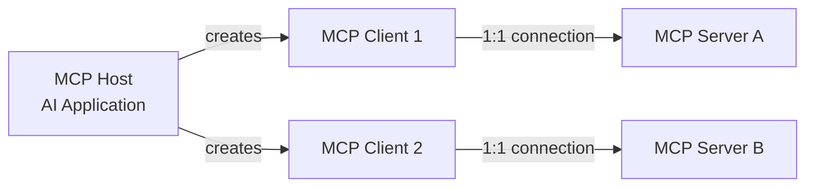

# MCP Comprehensive Guide
## From Concepts to Production Deployment with LangGraph Integration

**Last Updated**: October 23, 2025  
**Audience**: Developers, System Architects, AI Engineers  
**Prerequisites**: Python, FastAPI, Basic understanding of HTTP, Familiarity with AI/LLM concepts

---

## Table of Contents

1. [MCP Fundamentals](#1-mcp-fundamentals)
2. [MCP Architecture Deep Dive](#2-mcp-architecture-deep-dive)
3. [Transport Mechanisms](#3-transport-mechanisms)
4. [FastAPI MCP Server Implementation](#4-fastapi-mcp-server-implementation)
5. [NGINX Configuration for MCP](#5-nginx-configuration-for-mcp)
6. [Docker Deployment Strategy](#6-docker-deployment-strategy)
7. [LangGraph Integration](#7-langgraph-integration)
8. [LangChain Ecosystem](#8-langchain-ecosystem)
9. [Production Best Practices](#9-production-best-practices)
10. [Troubleshooting Guide](#10-troubleshooting-guide)

---

## 1. MCP Fundamentals

### 1.1 What is MCP?

**Model Context Protocol (MCP)** is an open protocol created by Anthropic that standardizes how AI applications (like Claude, VS Code, or custom agents) communicate with external data sources and tools.

**Think of MCP as:**
- 🔌 A "USB port" for AI applications - standard interface for any context source
- 📚 A library card catalog - helps AI find and access information
- 🔧 A universal toolbox - provides tools AI can use

**Key Insight**: MCP separates the "what" (protocol) from the "how" (transport), making it flexible and transport-agnostic.

### 1.2 Why MCP Matters

**Before MCP**:
```
AI App 1 → Custom Integration A → Service A
AI App 2 → Custom Integration B → Service A
AI App 1 → Custom Integration C → Service B
```

**With MCP**:
```
AI App 1 ─┐
AI App 2 ─┼─→ MCP Protocol → MCP Server A (Service A)
AI App 3 ─┘                 → MCP Server B (Service B)
```

**Benefits**:
- ✅ **Reusability**: Write once, use in any MCP-compatible app
- ✅ **Standardization**: Common protocol, predictable behavior
- ✅ **Discoverability**: AI can discover capabilities dynamically
- ✅ **Maintainability**: Update server, all clients benefit

### 1.3 Core Concepts

#### 1.3.1 Participants



- **MCP Host**: The AI application (Claude, VS Code, custom agent)
- **MCP Client**: Component that connects to a single MCP server
- **MCP Server**: Program that provides context/tools to clients

**Important**: Each MCP Client maintains a **dedicated 1:1 connection** with its MCP Server.

#### 1.3.2 Three Core Primitives

MCP servers expose **three types of primitives**:

##### 🔧 **1. Tools** (Model-Controlled)
- **What**: Executable functions AI can invoke
- **Who Decides**: The AI/LLM decides when to use them
- **Examples**:
  ```python
  @mcp.tool()
  def get_next_train_schedule(line: str, sta: str) -> str:
      """Get real-time train arrivals"""
      return call_mtr_api(line, sta)
  ```
- **Discovery Pattern**: `tools/list` → `tools/call`
- **Use Case**: Actions that change state or fetch dynamic data

##### 📚 **2. Resources** (Application-Controlled)
- **What**: Static/semi-static data sources
- **Who Decides**: The application loads them as context
- **Examples**:
  ```python
  @mcp.resource("mtr://stations/list")
  def get_station_list() -> str:
      """Returns markdown list of all 93 MTR stations"""
      return "# MTR Stations\n..."
  ```
- **Discovery Pattern**: `resources/list` → `resources/read`
- **Use Case**: Reference data, documentation, schemas

##### 💬 **3. Prompts** (User-Controlled)
- **What**: Reusable templates for AI interactions
- **Who Decides**: User selects/invokes them
- **Examples**:
  ```python
  @mcp.prompt()
  def check_next_train(line: str, station: str) -> str:
      """Template for checking train schedules"""
      return f"Please check trains at {station} on line {line}..."
  ```
- **Discovery Pattern**: `prompts/list` → `prompts/get`
- **Use Case**: Common workflows, structured queries

**Decision Matrix**:
| Primitive | Who Controls? | Dynamic? | Changes State? |
|-----------|---------------|----------|----------------|
| Tools | AI Model | Yes | Yes/No |
| Resources | Application | No | No |
| Prompts | User/App | No | No |

---

## 2. MCP Architecture Deep Dive

### 2.1 Layered Architecture

MCP consists of **two layers**:

```
┌─────────────────────────────────────────────┐
│         APPLICATION LAYER                   │
│  (AI App, LangGraph Agent, Claude Desktop)  │
└──────────────┬──────────────────────────────┘
               │
┌──────────────▼──────────────────────────────┐
│         DATA LAYER (Inner)                  │
│  • JSON-RPC 2.0 Messages                    │
│  • Lifecycle Management (initialize)        │
│  • Primitives (tools, resources, prompts)   │
│  • Notifications                            │
└──────────────┬──────────────────────────────┘
               │
┌──────────────▼──────────────────────────────┐
│         TRANSPORT LAYER (Outer)             │
│  • stdio (Local processes)                  │
│  • Streamable HTTP (Remote servers)         │
│  • Custom transports                        │
└─────────────────────────────────────────────┘
```

### 2.2 Data Layer Protocol

#### 2.2.1 JSON-RPC 2.0 Format

All MCP communication uses **JSON-RPC 2.0**:

```json
{
  "jsonrpc": "2.0",
  "id": 1,
  "method": "tools/list",
  "params": {}
}
```

**Three message types**:
1. **Request**: Expects a response (has `id`)
2. **Response**: Answer to a request (same `id`)
3. **Notification**: No response expected (no `id`)

#### 2.2.2 Lifecycle Management

**Initialization Sequence**:

```
Client                                   Server
  │                                        │
  │ ──── initialize (protocolVersion) ──>  │
  │                                        │
  │ <── InitializeResult (capabilities) ─  │
  │                                        │
  │ ──── notifications/initialized ─────>  │
  │                                        │
  │ ═══════ Session Active ═══════════════ │
```

**Step 1: Initialize Request**
```json
{
  "jsonrpc": "2.0",
  "id": 1,
  "method": "initialize",
  "params": {
    "protocolVersion": "2025-06-18",
    "capabilities": {
      "elicitation": {}
    },
    "clientInfo": {
      "name": "my-client",
      "version": "1.0.0"
    }
  }
}
```

**Step 2: Initialize Response**
```json
{
  "jsonrpc": "2.0",
  "id": 1,
  "result": {
    "protocolVersion": "2025-06-18",
    "capabilities": {
      "tools": {"listChanged": true},
      "resources": {},
      "prompts": {}
    },
    "serverInfo": {
      "name": "mtr_next_train",
      "version": "1.0.0"
    }
  }
}
```

**Step 3: Initialized Notification**
```json
{
  "jsonrpc": "2.0",
  "method": "notifications/initialized"
}
```

**Why This Matters**:
1. **Protocol Version Negotiation**: Ensures compatibility
2. **Capability Discovery**: Client knows what server supports
3. **Identity Exchange**: Debugging and version tracking

#### 2.2.3 Primitive Discovery & Execution

**Example: Tool Usage Flow**

```
┌─────────┐                              ┌─────────┐
│ Client  │                              │ Server  │
└────┬────┘                              └────┬────┘
     │                                        │
     │ 1. Discover available tools            │
     │ ──── tools/list ─────────────────────→ │
     │ ←─── {tools: [...]} ─────────────────  │
     │                                        │
     │ 2. Execute a tool                      │
     │ ──── tools/call(name, args) ─────────→ │
     │ ←─── {content: [...]} ───────────────  │
     │                                        │
     │ 3. Server notifies of changes          │
     │ ←─── notifications/tools/list_changed  │
     │                                        │
     │ 4. Re-discover tools                   │
     │ ──── tools/list ─────────────────────→ │
     │ ←─── {tools: [...]} ─────────────────  │
```

---

## 3. Transport Mechanisms

### 3.1 stdio Transport (Local)

**Use Case**: Local MCP servers running on the same machine as the client.

**How It Works**:
```
┌──────────────┐
│ Claude.app   │ (MCP Host)
└──────┬───────┘
       │ launches subprocess
       ▼
┌──────────────┐
│ mcp_server.py│ (MCP Server)
└──────────────┘

Communication: stdin/stdout
Protocol: JSON-RPC messages, newline-delimited
```

**Message Format**:
```json
{"jsonrpc":"2.0","id":1,"method":"tools/list"}\n
{"jsonrpc":"2.0","id":1,"result":{"tools":[...]}}\n
```

**Key Rules**:
- ✅ Messages are **newline-delimited**
- ✅ Server reads from `stdin`, writes to `stdout`
- ✅ Server can log to `stderr` (for debugging)
- ❌ No embedded newlines in messages
- ❌ Nothing else on stdout except MCP messages

**Advantages**:
- ⚡ Zero network overhead
- 🔒 Secure (no network exposure)
- 🚀 Fast process-to-process communication

**Disadvantages**:
- 📍 Local only (same machine)
- 🔄 One client per server instance

### 3.2 Streamable HTTP Transport (Remote)

**Use Case**: Remote MCP servers accessible over network (your MTR MCP server!).

**Protocol Version**: `2025-06-18` (replaces old HTTP+SSE)

#### 3.2.1 Architecture

```
┌────────────────┐     HTTPS      ┌────────────────┐
│  MCP Client    │ ──────────────→ │ NGINX Proxy    │
│  (Inspector)   │ ←────────────── │ (SSL/TLS)      │
└────────────────┘                 └────────┬───────┘
                                            │ HTTP
                                            ▼
                                   ┌────────────────┐
                                   │ FastAPI Server │
                                   │   (Port 8080)  │
                                   └────────────────┘
```

#### 3.2.2 Dual HTTP Methods

**1. POST (Client-to-Server Messages)**

```http
POST /mcp/sse HTTP/1.1
Host: project-1-04.eduhk.hk
Accept: application/json, text/event-stream
Content-Type: application/json
MCP-Protocol-Version: 2025-06-18

{"jsonrpc":"2.0","id":1,"method":"initialize",...}
```

**Response Options**:

**Option A: Single JSON Response** (for simple requests)
```http
HTTP/1.1 200 OK
Content-Type: application/json

{"jsonrpc":"2.0","id":1,"result":{...}}
```

**Option B: SSE Stream** (for streaming/complex responses)
```http
HTTP/1.1 200 OK
Content-Type: text/event-stream

event: message
data: {"jsonrpc":"2.0","id":1,"result":{...}}

event: message
data: {"jsonrpc":"2.0","method":"notifications/..."}

```

**2. GET (Server-to-Client Notifications)**

```http
GET /mcp/sse HTTP/1.1
Host: project-1-04.eduhk.hk
Accept: text/event-stream
```

**Response**:
```http
HTTP/1.1 200 OK
Content-Type: text/event-stream

event: message
data: {"jsonrpc":"2.0","method":"notifications/message",...}

event: message
data: {"jsonrpc":"2.0","method":"tools/list_changed"}

```

#### 3.2.3 Session Management

**Optional but Recommended** for stateful servers:

```http
POST /mcp/sse HTTP/1.1
Content-Type: application/json

{"jsonrpc":"2.0","method":"initialize",...}
```

**Server Response with Session ID**:
```http
HTTP/1.1 200 OK
Mcp-Session-Id: abc123-def456-ghi789
Content-Type: text/event-stream

event: message
data: {"jsonrpc":"2.0","result":{...}}
```

**Subsequent Requests**:
```http
POST /mcp/sse HTTP/1.1
Mcp-Session-Id: abc123-def456-ghi789

{"jsonrpc":"2.0","method":"tools/list"}
```

**Session Termination**:
```http
DELETE /mcp/sse HTTP/1.1
Mcp-Session-Id: abc123-def456-ghi789
```

#### 3.2.4 Security Considerations

⚠️ **Critical Security Rules**:

1. **Validate Origin Header**: Prevent DNS rebinding attacks
   ```python
   origin = request.headers.get("Origin")
   if origin and not is_allowed_origin(origin):
       return JSONResponse(status_code=403)
   ```

2. **Bind to localhost for local servers**:
   ```python
   # ✅ Good (local only)
   uvicorn.run(app, host="127.0.0.1", port=8080)
   
   # ❌ Bad (exposes to network)
   uvicorn.run(app, host="0.0.0.0", port=8080)
   ```

3. **Implement Authentication**:
   ```http
   Authorization: Bearer <token>
   X-API-Key: <api-key>
   ```

---

## 4. FastAPI MCP Server Implementation

### 4.1 Architecture Overview

**Your MTR MCP Server Structure**:

```
┌─────────────────────────────────────────────┐
│   fastapi_mcp_integration.py                │
│   (HTTP/SSE Transport Layer)                │
│                                             │
│   ┌────────────────────────────────────┐    │
│   │ POST /mcp/sse                      │    │
│   │   • Streamable HTTP (2025-06-18)   │    │
│   │   • Receives JSON-RPC messages     │    │
│   │   • Returns SSE stream             │    │
│   └──────────┬─────────────────────────┘    │
│              │ imports & calls              │
│              ▼                              │
│   ┌────────────────────────────────────┐    │
│   │ mcp_server.py                      │    │
│   │   (MCP Business Logic)             │    │
│   │                                    │    │
│   │   @mcp.tool()                      │    │
│   │   get_next_train_schedule()        │    │
│   │                                    │    │
│   │   @mcp.resource("mtr://...")       │    │
│   │   get_station_list()               │    │
│   │                                    │    │
│   │   @mcp.prompt()                    │    │
│   │   check_next_train()               │    │
│   └──────────┬─────────────────────────┘    │
│              │ HTTP requests                │
│              ▼                              │
│   ┌────────────────────────────────────┐    │
│   │ MTR Government API                 │    │
│   │ rt.data.gov.hk                     │    │
│   └────────────────────────────────────┘    │
└─────────────────────────────────────────────┘
```

### 4.2 Key Implementation Patterns

#### 4.2.1 Dual Protocol Support (POST + GET)

```python
@app.api_route("/sse", methods=["GET", "POST"])
async def sse_endpoint(request: Request):
    """Support both Streamable HTTP and legacy"""
    
    if request.method == "POST":
        # NEW: Streamable HTTP (2025-06-18)
        body = await request.json()
        method = body.get("method")
        
        if method == "initialize":
            # Return SSE stream with InitializeResult
            return StreamingResponse(
                init_stream(),
                media_type="text/event-stream"
            )
        else:
            # Handle other methods
            return await handle_json_rpc_request(body)
    
    else:  # GET
        # OLD: HTTP+SSE (2024-11-05) - backwards compatibility
        return StreamingResponse(
            event_stream(),
            media_type="text/event-stream"
        )
```

**Why Dual Support?**
- ✅ New clients use POST (Inspector v0.15+)
- ✅ Old clients use GET (Claude Desktop, etc.)
- ✅ Smooth migration path

#### 4.2.2 SSE Stream Format

```python
async def init_stream():
    """Streamable HTTP SSE stream"""
    # 1. Send initialize result
    init_result = {
        "jsonrpc": "2.0",
        "id": request_id,
        "result": {
            "protocolVersion": "2025-06-18",
            "capabilities": {...},
            "serverInfo": {...}
        }
    }
    yield f"event: message\ndata: {json.dumps(init_result)}\n\n"
    
    # 2. Keep connection alive with heartbeats
    while True:
        notification = {
            "jsonrpc": "2.0",
            "method": "notifications/message",
            "params": {"level": "info", ...}
        }
        yield f"event: message\ndata: {json.dumps(notification)}\n\n"
        await asyncio.sleep(30)  # Every 30 seconds
```

**SSE Format Rules**:
```
event: message
data: <JSON-RPC message>

<blank line>
```

#### 4.2.3 Tool/Resource/Prompt Handlers

**Pattern: Separate handler function**

```python
async def handle_json_rpc_request(json_rpc_request: dict):
    """Central dispatcher for all JSON-RPC methods"""
    method = json_rpc_request.get("method")
    params = json_rpc_request.get("params", {})
    request_id = json_rpc_request.get("id")
    
    if method == "tools/list":
        return JSONResponse({
            "jsonrpc": "2.0",
            "id": request_id,
            "result": {
                "tools": [
                    {
                        "name": "get_next_train_schedule",
                        "description": "Get MTR train schedule",
                        "inputSchema": {
                            "type": "object",
                            "properties": {
                                "line": {"type": "string"},
                                "sta": {"type": "string"}
                            },
                            "required": ["line", "sta"]
                        }
                    }
                ]
            }
        })
    
    elif method == "tools/call":
        tool_name = params.get("name")
        arguments = params.get("arguments", {})
        
        # CALL REAL FUNCTION FROM mcp_server.py
        from mcp_server import get_next_train_schedule
        result = get_next_train_schedule(**arguments)
        
        return JSONResponse({
            "jsonrpc": "2.0",
            "id": request_id,
            "result": {
                "content": [{"type": "text", "text": result}]
            }
        })
```

**Why This Pattern?**
- ✅ Reusable across POST and GET endpoints
- ✅ Centralized error handling
- ✅ Easy to test

#### 4.2.4 Protocol Version Handling

```python
# In handle_json_rpc_request()
if method == "initialize":
    # Echo client's requested version
    requested_version = params.get("protocolVersion", "2024-11-05")
    
    return JSONResponse({
        "jsonrpc": "2.0",
        "id": request_id,
        "result": {
            "protocolVersion": requested_version,  # ← Echo back!
            "capabilities": {...},
            "serverInfo": {...}
        }
    })
```

**Supported Versions**:
- `2025-06-18`: Latest, Streamable HTTP
- `2024-11-05`: Legacy, HTTP+SSE

### 4.3 Error Handling

```python
try:
    # Execute tool
    result = tool_function(**arguments)
    return JSONResponse({
        "jsonrpc": "2.0",
        "id": request_id,
        "result": {"content": [{"type": "text", "text": result}]}
    })
except Exception as e:
    logger.error(f"Tool execution error: {e}")
    return JSONResponse({
        "jsonrpc": "2.0",
        "id": request_id,
        "error": {
            "code": -32603,
            "message": "Internal error",
            "data": str(e)
        }
    })
```

**JSON-RPC Error Codes**:
- `-32700`: Parse error
- `-32600`: Invalid request
- `-32601`: Method not found
- `-32602`: Invalid params
- `-32603`: Internal error
- `-32000 to -32099`: Server-defined errors

---

## 5. NGINX Configuration for MCP

### 5.1 Why NGINX?

**Benefits**:
- 🔒 **SSL/TLS Termination**: Handles HTTPS
- 🚀 **Reverse Proxy**: Routes traffic to FastAPI
- 📊 **Load Balancing**: Can distribute across multiple backends
- 🛡️ **Security**: Rate limiting, IP filtering
- 📝 **Logging**: Access logs, error logs

### 5.2 SSE-Optimized Configuration

**Critical Settings for SSE**:

```nginx
location /mcp/ {
    # Proxy to FastAPI
    proxy_pass http://127.0.0.1:8080/mcp/;
    
    # SSE MUST use HTTP/1.1
    proxy_http_version 1.1;
    
    # Disable buffering (critical for SSE streaming)
    proxy_buffering off;
    
    # Keep connection alive
    proxy_set_header Connection "";
    
    # Pass headers
    proxy_set_header Host $host;
    proxy_set_header X-Real-IP $remote_addr;
    proxy_set_header X-Forwarded-For $proxy_add_x_forwarded_for;
    proxy_set_header X-Forwarded-Proto $scheme;
    
    # Long timeouts for SSE streams (24 hours)
    proxy_read_timeout 86400s;
    proxy_send_timeout 86400s;
    proxy_connect_timeout 10s;
    
    # Cache control for SSE
    add_header Cache-Control "no-cache, no-store, must-revalidate";
    add_header Pragma no-cache;
    add_header Expires 0;
}
```

**Why These Settings?**

| Setting | Purpose | Without It |
|---------|---------|------------|
| `proxy_http_version 1.1` | SSE requires HTTP/1.1 | 502 Bad Gateway |
| `proxy_buffering off` | Stream events immediately | Events delayed/batched |
| `Connection ""` | Keep-alive | Connection closes prematurely |
| `proxy_read_timeout 86400s` | Allow 24h streams | Timeout after 60s (default) |
| `Cache-Control no-cache` | Prevent caching SSE | Stale data served |

### 5.3 SSL Configuration

```nginx
server {
    listen 443 ssl http2;
    server_name project-1-04.eduhk.hk;
    
    # SSL certificates
    ssl_certificate /etc/nginx/certs/dept-wildcard.eduhk.crt;
    ssl_certificate_key /etc/nginx/certs/dept-wildcard.eduhk.key;
    
    # Modern SSL settings
    ssl_protocols TLSv1.2 TLSv1.3;
    ssl_ciphers HIGH:!aNULL:!MD5;
    ssl_prefer_server_ciphers on;
    
    # HSTS (optional but recommended)
    add_header Strict-Transport-Security "max-age=31536000" always;
    
    location /mcp/ {
        # ... SSE configuration ...
    }
}

# Redirect HTTP to HTTPS
server {
    listen 80;
    server_name project-1-04.eduhk.hk;
    return 301 https://$server_name$request_uri;
}
```

### 5.4 Troubleshooting NGINX + SSE

**Problem 1**: Events not streaming, buffered

```nginx
# ❌ Bad
proxy_buffering on;

# ✅ Good
proxy_buffering off;
```

**Problem 2**: Connection timeout after 60s

```nginx
# ❌ Bad (default)
proxy_read_timeout 60s;

# ✅ Good
proxy_read_timeout 86400s;  # 24 hours
```

**Problem 3**: 502 Bad Gateway

```nginx
# ❌ Bad (defaults to HTTP/1.0)
# proxy_http_version not set

# ✅ Good
proxy_http_version 1.1;
```

**Testing NGINX Configuration**:
```bash
# Test config syntax
sudo nginx -t

# Reload without downtime
sudo nginx -s reload

# Check error logs
sudo tail -f /var/log/nginx/error.log
```

---

## 6. Docker Deployment Strategy

### 6.1 Dockerfile Best Practices

**Your MTR MCP Dockerfile**:

```dockerfile
FROM python:3.11-slim

WORKDIR /app

# Copy requirements first (layer caching)
COPY requirements.txt .
RUN pip install --no-cache-dir -r requirements.txt

# Copy application code
COPY mcp_server.py .
COPY fastapi_mcp_integration.py .

# Health check (critical for Docker/K8s)
HEALTHCHECK --interval=30s --timeout=10s --start-period=5s --retries=3 \
  CMD curl -f http://localhost:8080/mcp/health || exit 1

# Non-root user (security)
RUN useradd -m -u 1000 mcpuser && chown -R mcpuser:mcpuser /app
USER mcpuser

# Expose port
EXPOSE 8080

# Run FastAPI
CMD ["python", "fastapi_mcp_integration.py"]
```

**Why This Structure?**
- 🎯 **Layer Caching**: `requirements.txt` changes less often than code
- 🔒 **Security**: Run as non-root user
- 💚 **Health Checks**: Docker can restart unhealthy containers
- 📦 **Slim Base**: `python:3.11-slim` is smaller than full Python image

### 6.2 docker-compose.yml

```yaml
version: '3.8'

services:
  mtr-mcp-server:
    build: .
    container_name: mtr-mcp-server
    ports:
      - "8080:8080"
    environment:
      - PYTHONUNBUFFERED=1
    restart: unless-stopped
    healthcheck:
      test: ["CMD", "curl", "-f", "http://localhost:8080/mcp/health"]
      interval: 30s
      timeout: 10s
      retries: 3
      start_period: 10s
    logging:
      driver: "json-file"
      options:
        max-size: "10m"
        max-file: "3"
```

**Key Features**:
- 🔄 **Auto-Restart**: `restart: unless-stopped`
- 💚 **Health Checks**: Integrated with Docker
- 📝 **Log Rotation**: Prevent disk fill-up
- 🌐 **Port Mapping**: 8080:8080

### 6.3 Deployment Workflow

```bash
# 1. Build image
docker-compose build

# 2. Start container
docker-compose up -d

# 3. Check logs
docker-compose logs -f

# 4. Check health
docker ps  # Should show "healthy" status

# 5. Stop and remove
docker-compose down

# 6. Rebuild and restart (after code changes)
docker-compose down
docker-compose up -d --build
```

### 6.4 Production Optimizations

**Multi-Stage Build** (reduce image size):

```dockerfile
# Stage 1: Builder
FROM python:3.11 as builder
WORKDIR /app
COPY requirements.txt .
RUN pip install --user --no-cache-dir -r requirements.txt

# Stage 2: Runtime
FROM python:3.11-slim
WORKDIR /app
# Copy only installed packages from builder
COPY --from=builder /root/.local /root/.local
COPY mcp_server.py fastapi_mcp_integration.py ./
ENV PATH=/root/.local/bin:$PATH
CMD ["python", "fastapi_mcp_integration.py"]
```

**Result**: Image size reduced from ~900MB to ~400MB

---

## 7. LangGraph Integration

### 7.1 What is LangGraph?

**LangGraph** is a framework for building **stateful, multi-step LLM applications** using **graphs**.

**Key Concepts**:
```
┌──────────┐     ┌──────────┐     ┌──────────┐
│  Node A  │────>│  Node B  │────>│  Node C  │
│ (Agent)  │     │ (Tools)  │     │ (Agent)  │
└──────────┘     └──────────┘     └──────────┘
     │                                   │
     └───────────────┬───────────────────┘
                     ▼
                ┌─────────┐
                │   END   │
                └─────────┘
```

**Benefits**:
- 🔄 **State Management**: Persistent conversation memory
- 🌳 **Conditional Routing**: Dynamic flow based on LLM decisions
- 🔧 **Tool Integration**: Seamless tool calling
- 💾 **Checkpoints**: Save and resume conversations
- 🔍 **Observability**: Built-in tracing

### 7.2 Your LangGraph Demo Architecture

**`langgraph_demo_full_mcp.py` Structure**:

```python
# 1. Connect to MCP Server
async with sse_client("http://127.0.0.1:8000/sse") as (read, write):
    async with ClientSession(read, write) as session:
        await session.initialize()
        
        # 2. Load MCP Resources (Application-controlled)
        resources = await load_mcp_resources(session)
        # Returns: {"stations": "...", "network": "..."}
        
        # 3. Discover MCP Tools (Model-controlled)
        tools, tool_funcs = await create_mcp_tools(session)
        # Returns: [get_next_train_schedule, get_next_train_structured]
        
        # 4. Build LangGraph Agent
        app = create_agent_graph(tools, resources, tool_funcs)
        
        # 5. Run Multi-turn Conversation with Memory
        config = {"configurable": {"thread_id": "demo-conversation"}}
        await chat_with_memory("What's the next train?", config)
```

### 7.3 Agent Graph Structure

```python
from langgraph.graph import StateGraph, END
from langgraph.checkpoint.memory import MemorySaver

def create_agent_graph(mcp_tools, resources, tool_functions):
    """Build LangGraph agent with MCP integration"""
    
    # Define state
    class AgentState(TypedDict):
        messages: Annotated[list, add_messages]
    
    # Create LLM with tools
    llm = ChatBedrock(model_id="amazon.nova-lite-v1:0")
    llm_with_tools = llm.bind_tools(mcp_tools)
    
    # System prompt with MCP resources
    SYSTEM_PROMPT = f"""You are an MTR assistant.

Resources:
{resources['stations']}
{resources['network']}

Tools available:
- get_next_train_schedule
- get_next_train_structured
"""
    
    # Define nodes
    async def call_model(state):
        """Node: Call LLM"""
        messages = [SystemMessage(content=SYSTEM_PROMPT)] + state["messages"]
        response = await llm_with_tools.ainvoke(messages)
        return {"messages": [response]}
    
    async def execute_tools(state):
        """Node: Execute any tool calls"""
        last_message = state["messages"][-1]
        tool_results = []
        
        for tool_call in last_message.tool_calls:
            result = await tool_functions[tool_call["name"]](**tool_call["args"])
            tool_results.append(ToolMessage(
                content=str(result),
                tool_call_id=tool_call["id"]
            ))
        
        return {"messages": tool_results}
    
    def should_continue(state):
        """Conditional edge: Continue or end?"""
        last_message = state["messages"][-1]
        if hasattr(last_message, 'tool_calls') and last_message.tool_calls:
            return "tools"
        return "end"
    
    # Build graph
    workflow = StateGraph(AgentState)
    workflow.add_node("agent", call_model)
    workflow.add_node("tools", execute_tools)
    workflow.set_entry_point("agent")
    workflow.add_conditional_edges("agent", should_continue, {
        "tools": "tools",
        "end": END
    })
    workflow.add_edge("tools", "agent")
    
    # Compile with memory
    memory = MemorySaver()
    return workflow.compile(checkpointer=memory)
```

**Graph Visualization**:

```
       START
         │
         ▼
     ┌───────┐
     │ Agent │  (call_model)
     └───┬───┘
         │
    [should_continue?]
         │
    ┌────┴────┐
    │         │
    ▼         ▼
┌───────┐   END
│ Tools │
└───┬───┘
    │
    └──────┐
           │
           ▼
       ┌───────┐
       │ Agent │  (loop back)
       └───────┘
```

### 7.4 MCP Integration Points

#### 7.4.1 Resources → System Prompt

```python
# Load MCP resources
station_content = await session.read_resource("mtr://stations/list")
stations_text = station_content.contents[0].text

network_content = await session.read_resource("mtr://lines/map")
network_text = network_content.contents[0].text

# Inject into system prompt
SYSTEM_PROMPT = f"""
You are an MTR assistant with access to:

{stations_text}

{network_text}

Use these to understand station locations and line connections.
"""
```

**Effect**: LLM has **static context** about all 93 stations and 10 lines without making tool calls.

#### 7.4.2 Tools → LangChain Tool Format

```python
@tool
async def get_next_train_schedule(line: str, sta: str, lang: str = "EN") -> str:
    """Get MTR train schedule. Use line codes like TKL and station codes like TKO."""
    # Call MCP server
    result = await session.call_tool("get_next_train_schedule", 
                                      arguments={"line": line, "sta": sta, "lang": lang})
    return str(result.content[0].text)

# Bind to LLM
tools = [get_next_train_schedule, get_next_train_structured]
llm_with_tools = llm.bind_tools(tools)
```

**Effect**: LLM can **dynamically invoke** MCP tools during conversation.

#### 7.4.3 Prompts → User Templates

```python
# Get prompt from MCP server
prompt = await session.get_prompt("check_next_train", 
                                  arguments={"line": "TKL", "station": "TKO"})
prompt_text = prompt.messages[0].content.text

# Use in conversation
await chat_with_memory(prompt_text, config)
```

**Effect**: **User-controlled** templates guide LLM behavior.

### 7.5 Memory & Multi-turn Conversations

```python
# Memory configuration
config = {"configurable": {"thread_id": "full-mcp-demo-conversation"}}

# Turn 1
response1 = await app.ainvoke(
    {"messages": [HumanMessage(content="Next train from TKO?")]},
    config=config
)

# Turn 2 - References Turn 1 context
response2 = await app.ainvoke(
    {"messages": [HumanMessage(content="What about the other direction?")]},
    config=config  # SAME thread_id = memory persists!
)
```

**How It Works**:
1. **MemorySaver** checkpoint stores state after each turn
2. **thread_id** identifies the conversation
3. **add_messages** merges new messages with history
4. LLM sees **full conversation context**

**Memory Flow**:
```
Turn 1: [System, User: "Next train from TKO?", Agent: "...", Tool: "...", Agent: "..."]
         └───────────────────────────────────────────────────────────────────────────┘
                                          │ Saved to checkpoint
                                          ▼
Turn 2: [System, User: "Next train from TKO?", ..., User: "Other direction?", ...]
         └───── Retrieved from checkpoint ────────┘
```

---

## 8. LangChain Ecosystem

### 8.1 LangChain Components

**LangChain** is a framework for building LLM applications. Key components used in your demo:

#### 8.1.1 ChatModels

```python
from langchain_aws import ChatBedrock

llm = ChatBedrock(
    model_id="amazon.nova-lite-v1:0",
    region_name="us-east-1",
    model_kwargs={"temperature": 0.7}
)

# Usage
response = await llm.ainvoke([
    SystemMessage(content="You are a helpful AI assistant"),
    HumanMessage(content="Hi!")
])
```

**Why ChatBedrock?**
- 🎯 **Serverless**: No infrastructure management
- 💰 **Pay-per-use**: Only pay for tokens used
- 🚀 **Nova Lite**: Fast and cost-effective

#### 8.1.2 Messages

```python
from langchain_core.messages import (
    SystemMessage,   # System prompts
    HumanMessage,    # User inputs
    AIMessage,       # LLM responses
    ToolMessage      # Tool results
)

# Conversation structure
messages = [
    SystemMessage(content="You are an MTR assistant"),
    HumanMessage(content="Next train?"),
    AIMessage(content="", tool_calls=[...]),  # LLM wants to call tool
    ToolMessage(content="...", tool_call_id="..."),  # Tool result
    AIMessage(content="The next train arrives in 2 minutes")  # Final answer
]
```

#### 8.1.3 Tools

```python
from langchain_core.tools import tool

@tool
def get_weather(city: str) -> str:
    """Get weather for a city"""
    return f"Weather in {city}: Sunny, 72°F"

# Bind to LLM
llm_with_tools = llm.bind_tools([get_weather])

# LLM will generate tool calls
response = await llm_with_tools.ainvoke([
    HumanMessage(content="What's the weather in SF?")
])

# response.tool_calls = [{"name": "get_weather", "args": {"city": "SF"}, "id": "..."}]
```

### 8.2 LangGraph vs LangChain

**LangChain** (older, simpler):
```python
# Sequential chain
chain = SystemMessagePromptTemplate.from_template("...") | llm | StrOutputParser()
result = await chain.ainvoke({"input": "..."})
```

**LangGraph** (newer, more powerful):
```python
# Graph-based with state and loops
workflow = StateGraph(AgentState)
workflow.add_node("agent", call_model)
workflow.add_node("tools", execute_tools)
workflow.add_edge("tools", "agent")  # Loop back!
app = workflow.compile()
```

**When to Use What?**

| Use Case | LangChain | LangGraph |
|----------|-----------|-----------|
| Simple Q&A | ✅ | ❌ (overkill) |
| RAG (Retrieval) | ✅ | ✅ |
| Multi-turn with state | ❌ | ✅ |
| Tool calling loops | ❌ | ✅ |
| Custom routing | ❌ | ✅ |
| Memory/checkpoints | Basic | Advanced |

### 8.3 How Your Demo Uses LangChain

```python
# 1. Chat Model
from langchain_aws import ChatBedrock
llm = ChatBedrock(...)

# 2. Tool Binding
from langchain_core.tools import tool
@tool
async def get_next_train_schedule(...):
    ...
llm_with_tools = llm.bind_tools([get_next_train_schedule])

# 3. Message Types
from langchain_core.messages import HumanMessage, AIMessage, ToolMessage
messages = [HumanMessage(content="...")]

# 4. LangGraph State
from langgraph.graph import StateGraph, add_messages
class AgentState(TypedDict):
    messages: Annotated[list, add_messages]

# 5. Memory
from langgraph.checkpoint.memory import MemorySaver
memory = MemorySaver()
app = workflow.compile(checkpointer=memory)
```

---

## 9. Production Best Practices

### 9.1 Monitoring & Observability

#### 9.1.1 LangSmith Integration

```python
# .env
LANGCHAIN_TRACING_V2=true
LANGCHAIN_API_KEY=your-key
LANGCHAIN_PROJECT=mtr-mcp-production

# Automatic tracing
llm = ChatBedrock(...)  # All calls traced
```

**LangSmith Dashboard Shows**:
- 📊 Token usage and costs
- ⏱️ Latency per step
- 🔧 Tool invocations
- 🐛 Error traces
- 📈 Performance trends

#### 9.1.2 Application Logging

```python
import logging

logging.basicConfig(
    level=logging.INFO,
    format='%(asctime)s - %(name)s - %(levelname)s - %(message)s',
    handlers=[
        logging.FileHandler("mcp_server.log"),
        logging.StreamHandler()
    ]
)

logger = logging.getLogger(__name__)

@app.post("/mcp/sse")
async def sse_endpoint(request: Request):
    logger.info(f"Received request: {request.method} {request.url}")
    try:
        # ... handle request ...
        logger.info(f"Request successful: method={method}")
    except Exception as e:
        logger.error(f"Request failed: {e}", exc_info=True)
        raise
```

### 9.2 Error Handling & Retries

```python
import httpx
from tenacity import retry, stop_after_attempt, wait_exponential

@retry(
    stop=stop_after_attempt(3),
    wait=wait_exponential(multiplier=1, min=2, max=10)
)
async def call_mtr_api(line: str, sta: str) -> dict:
    """Call MTR API with retries"""
    async with httpx.AsyncClient() as client:
        response = await client.get(
            "https://rt.data.gov.hk/v1/transport/mtr/getSchedule.php",
            params={"line": line, "sta": sta},
            timeout=10.0
        )
        response.raise_for_status()
        return response.json()
```

**Retry Strategy**:
- Attempt 1: Immediate
- Attempt 2: Wait 2s
- Attempt 3: Wait 4s
- Then fail with exception

### 9.3 Rate Limiting

```python
from slowapi import Limiter, _rate_limit_exceeded_handler
from slowapi.util import get_remote_address
from slowapi.errors import RateLimitExceeded

limiter = Limiter(key_func=get_remote_address)
app.state.limiter = limiter
app.add_exception_handler(RateLimitExceeded, _rate_limit_exceeded_handler)

@app.post("/mcp/sse")
@limiter.limit("10/minute")
async def sse_endpoint(request: Request):
    """Rate limited: 10 requests per minute per IP"""
    ...
```

### 9.4 Caching Strategies

```python
from functools import lru_cache
from datetime import datetime, timedelta

# In-memory cache for station list (changes rarely)
@lru_cache(maxsize=1)
def get_cached_station_list():
    """Cache station list (static data)"""
    return get_station_list()

# Time-based cache for train schedules
train_schedule_cache = {}

async def get_next_train_schedule_cached(line: str, sta: str):
    """Cache train schedules for 30 seconds"""
    cache_key = f"{line}:{sta}"
    now = datetime.now()
    
    if cache_key in train_schedule_cache:
        cached_time, cached_data = train_schedule_cache[cache_key]
        if now - cached_time < timedelta(seconds=30):
            return cached_data
    
    # Fetch fresh data
    data = await call_mtr_api(line, sta)
    train_schedule_cache[cache_key] = (now, data)
    return data
```

### 9.5 Security Checklist

- [ ] **SSL/TLS**: Always use HTTPS in production
- [ ] **Authentication**: Implement API keys or OAuth
- [ ] **Input Validation**: Sanitize all user inputs
- [ ] **Rate Limiting**: Prevent abuse
- [ ] **CORS**: Restrict origins in production
- [ ] **Security Headers**: HSTS, X-Frame-Options, etc.
- [ ] **Secrets Management**: Use environment variables, not hardcoded
- [ ] **Error Messages**: Don't leak sensitive info in errors
- [ ] **Logging**: Log requests but sanitize sensitive data
- [ ] **Updates**: Keep dependencies up to date

---

## 10. Troubleshooting Guide

### 10.1 Common Issues

#### Issue 1: "Connection Error" in MCP Inspector

**Symptoms**:
- Inspector shows "Connection Error"
- Heartbeat notifications visible but no tools/resources

**Causes**:
1. Protocol version mismatch
2. Missing `initialize` response
3. Incorrect SSE format

**Diagnosis**:
```bash
# Check server logs
docker logs mtr-mcp-server

# Test SSE endpoint
curl -N -H "Accept: text/event-stream" https://your-server.com/mcp/sse

# Expected:
event: message
data: {...}
```

**Solutions**:
```python
# 1. Echo client's protocol version
requested_version = params.get("protocolVersion", "2024-11-05")
return {"protocolVersion": requested_version}  # Don't hardcode!

# 2. Ensure SSE format is correct
yield f"event: message\ndata: {json.dumps(msg)}\n\n"
#                                               ^^^^ Two newlines!

# 3. Implement POST endpoint for Streamable HTTP
@app.api_route("/sse", methods=["GET", "POST"])
```

#### Issue 2: "Method not found: resources/read"

**Symptoms**:
- Tools/resources listed successfully
- Clicking them gives "Method not found" error

**Cause**: Handler missing or not registered

**Solution**:
```python
async def handle_json_rpc_request(json_rpc_request: dict):
    method = json_rpc_request.get("method")
    
    # ADD ALL HANDLERS
    if method == "resources/read":
        uri = params.get("uri")
        if uri == "mtr://stations/list":
            from mcp_server import get_station_list
            content = get_station_list()
            return JSONResponse({
                "jsonrpc": "2.0",
                "id": request_id,
                "result": {
                    "contents": [{"uri": uri, "mimeType": "text/plain", "text": content}]
                }
            })
```

#### Issue 3: "API Error: NT-301 - Please type the line-station"

**Symptoms**:
- Tool executes but returns API error
- Error from MTR API, not MCP server

**Cause**: Swapped parameters! MTR API expects `?line=TKL&sta=TKO`

**Solution**:
```python
# ❌ Bad schema
"station": {"type": "string", "description": "Station code"}  # labeled wrong!
"line": {"type": "string", "description": "Line code"}

# ✅ Good schema  
"line": {"type": "string", "description": "Line code like TKL"}
"sta": {"type": "string", "description": "Station code like TKO"}

# In tool function
url = f"...?line={line}&sta={sta}"  # NOT line={sta}&sta={line}!
```

#### Issue 4: SSE Stream Not Streaming

**Symptoms**:
- Events arrive all at once after long delay
- Connection times out

**Cause**: NGINX buffering enabled

**Solution**:
```nginx
location /mcp/ {
    proxy_buffering off;  # ← CRITICAL
    proxy_http_version 1.1;
    proxy_read_timeout 86400s;
}
```

**Test**:
```bash
# Should show events as they arrive (every 30s)
curl -N https://your-server.com/mcp/sse
```

#### Issue 5: LangGraph Agent Not Calling Tools

**Symptoms**:
- Agent responds without using tools
- Tools are discovered but never invoked

**Causes**:
1. LLM doesn't understand tool descriptions
2. Tool schema is unclear
3. System prompt doesn't mention tools

**Solutions**:
```python
# 1. Improve tool descriptions
@tool
async def get_next_train_schedule(line: str, sta: str, lang: str = "EN") -> str:
    """
    Get REAL-TIME train arrivals for MTR stations.
    
    Args:
        line: MTR line CODE (TKL, ISL, TWL, etc.) - NOT the full name
        sta: Station CODE (TKO, CEN, TST, etc.) - NOT the full name
        lang: "EN" for English or "TC" for Chinese
        
    Returns:
        Formatted text with train arrival times and platforms.
        
    Example:
        line="TKL", sta="TKO" → Shows trains at Tseung Kwan O station
    """
    ...

# 2. Mention tools in system prompt
SYSTEM_PROMPT = """
You are an MTR assistant with access to REAL-TIME train data.

IMPORTANT: Use the get_next_train_schedule tool to fetch current train times.
DO NOT guess or make up train schedules. ALWAYS use the tool.

When user asks about trains:
1. Identify the line code (TKL, ISL, etc.) from their question
2. Identify the station code (TKO, CEN, etc.)
3. Call get_next_train_schedule(line="X", sta="Y")
4. Report the results to the user
"""

# 3. Make tool schema clear
"inputSchema": {
    "type": "object",
    "properties": {
        "line": {
            "type": "string",
            "description": "MTR line code (TKL, ISL, TWL, AEL, etc.)",
            "enum": ["TKL", "ISL", "TWL", "KTL", "EAL", "TML", "TCL", "AEL", "SIL", "DRL"]
        },
        "sta": {
            "type": "string",
            "description": "Station code (TKO, CEN, TST, etc.)"
        }
    },
    "required": ["line", "sta"]
}
```

### 10.2 Debugging Tips

**1. Enable Verbose Logging**:
```python
logging.basicConfig(level=logging.DEBUG)
```

**2. Test MCP Server Directly**:
```python
# test_mcp.py
import asyncio
from mcp import ClientSession
from mcp.client.sse import sse_client

async def test():
    async with sse_client("http://127.0.0.1:8000/sse") as (read, write):
        async with ClientSession(read, write) as session:
            # Initialize
            await session.initialize()
            print("✓ Connected")
            
            # List tools
            tools = await session.list_tools()
            print(f"✓ Found {len(tools.tools)} tools")
            
            # Call tool
            result = await session.call_tool("get_next_train_schedule", {
                "line": "TKL",
                "sta": "TKO"
            })
            print(f"✓ Tool result: {result.content[0].text[:100]}...")

asyncio.run(test())
```

**3. Use MCP Inspector**:
```
npm install -g @modelcontextprotocol/inspector
mcp-inspector
```

**4. Check Network Traffic**:
```bash
# On Ubuntu server
sudo tcpdump -i any -A 'port 8080'

# Or use browser DevTools Network tab
```

**5. Validate JSON-RPC Messages**:
```python
import json
import jsonschema

# Validate against JSON-RPC 2.0 schema
message = {"jsonrpc": "2.0", "method": "tools/list", "id": 1}
# ... validation code ...
```

---

## 11. Summary & Best Practices

### 11.1 MCP Architecture Recap

```
┌─────────────────────────────────────────────┐
│ MCP HOST (AI Application)                  │
├─────────────────────────────────────────────┤
│ MCP CLIENT                                  │
├─────────────────────────────────────────────┤
│ TRANSPORT (stdio / Streamable HTTP)         │
├─────────────────────────────────────────────┤
│ DATA LAYER (JSON-RPC 2.0)                  │
│  • Lifecycle (initialize)                   │
│  • Primitives (tools, resources, prompts)  │
│  • Notifications                            │
├─────────────────────────────────────────────┤
│ MCP SERVER (Your FastAPI + mcp_server.py) │
└─────────────────────────────────────────────┘
```

### 11.2 Key Takeaways

1. **MCP is Protocol, Not Implementation**: Focus on JSON-RPC messages, not specific SDKs
2. **Separation of Concerns**: Transport (HTTP/SSE) separate from Data (JSON-RPC)
3. **Three Primitives**: Tools (AI), Resources (App), Prompts (User)
4. **Dual Protocol Support**: Implement both POST (new) and GET (old) for compatibility
5. **NGINX is Critical for SSE**: Disable buffering, use HTTP/1.1, long timeouts
6. **LangGraph for State**: Use when you need memory, loops, or complex routing
7. **MCP Resources → System Prompt**: Load static context once
8. **MCP Tools → LangChain Tools**: Wrap for LLM to invoke dynamically
9. **Observability Matters**: Use LangSmith, logging, health checks
10. **Security First**: SSL, authentication, rate limiting, input validation

### 11.3 Common Pitfalls

| Pitfall | Solution |
|---------|----------|
| Hardcoding protocol version | Echo client's requested version |
| Missing newlines in SSE | `\n\n` after each event |
| NGINX buffering enabled | `proxy_buffering off` |
| Swapped API parameters | Match schema names to API exactly |
| No error handling | Wrap all I/O in try/except |
| Blocking operations | Use async/await |
| No health checks | Implement `/health` endpoint |
| Exposing secrets | Use environment variables |
| No logging | Log all requests and errors |
| Testing in production | Use staging environment first |

### 11.4 Production Checklist

**Before Going Live**:
- [ ] Protocol version negotiation working
- [ ] All three primitives (tools, resources, prompts) implemented
- [ ] Error handling for all endpoints
- [ ] Health check endpoint responsive
- [ ] NGINX SSL configured correctly
- [ ] Docker health checks working
- [ ] Logging configured (file + stdout)
- [ ] Rate limiting enabled
- [ ] CORS restricted to known origins
- [ ] API keys/authentication implemented
- [ ] Load testing completed
- [ ] Monitoring/alerting set up (LangSmith, etc.)
- [ ] Backup/disaster recovery plan
- [ ] Documentation up to date

---

## 12. Additional Resources

### 12.1 Official Documentation

- **MCP Specification**: https://modelcontextprotocol.io/
- **MCP GitHub**: https://github.com/modelcontextprotocol/specification
- **MCP Python SDK**: https://github.com/modelcontextprotocol/python-sdk
- **LangGraph Docs**: https://langchain-ai.github.io/langgraph/
- **LangChain Docs**: https://python.langchain.com/

### 12.2 Example Implementations

- **MCP Servers**: https://github.com/modelcontextprotocol/servers
- **Your MTR Server**: https://github.com/enoch-sit/mtrmcp
- **FastMCP**: https://github.com/jlowin/fastmcp

### 12.3 Tools

- **MCP Inspector**: `npm install -g @modelcontextprotocol/inspector`
- **LangSmith**: https://smith.langchain.com/
- **Docker**: https://docs.docker.com/
- **NGINX**: https://nginx.org/en/docs/

---

**🎉 Congratulations!** You now understand:
- ✅ MCP protocol architecture and concepts
- ✅ How to implement MCP servers with FastAPI
- ✅ Streamable HTTP transport with SSE
- ✅ NGINX configuration for production
- ✅ Docker deployment strategies
- ✅ LangGraph integration patterns
- ✅ LangChain ecosystem usage
- ✅ Production best practices and troubleshooting

**Next Steps**:
1. Review your `fastapi_mcp_integration.py` with new understanding
2. Experiment with adding new tools/resources/prompts
3. Implement authentication and rate limiting
4. Set up monitoring with LangSmith
5. Build more complex LangGraph agents
6. Explore multi-agent systems with MCP

**Happy Building! 🚀**
